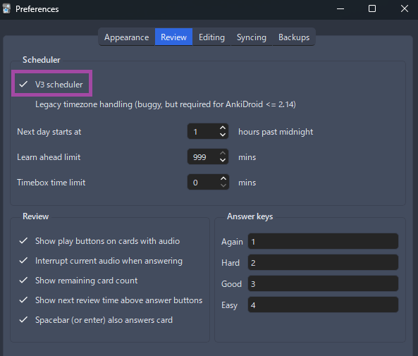

---
hide:
  - footer
---
# Concise Guide to Jumpstart Japanese

- Very short concise guide to combat other guides with walls of text and links to paid stuff that's unnecessary, especially confusing for beginners

- I'm a JLPT N2 Passer, in case there is an issue on trusting me

## Tips

??? tips "5 Tips for Beginners <small>(click here)</small>"
    - `Consistency and pay attention are the secret`, no actual other cheat

    - `Don't compare yourself to others`, don't give up, don't listen to quick success in x time

    - Just do it, `many others spend more time figuring out than actually doing`, you will never be ready if you never do it

    - `Time/Number listed is not strict`, even if it takes you x10 longer or lesser day/minimum of what I listed, its only a baseline

    - No, `you are not stupid/too old`, if you can learn your native, you can learn other language, even parrots learned

---

## Step by Step Process

1. Learn `Kana`; [Hiragana](https://www.tofugu.com/japanese/learn-hiragana/)(first) and [Katakana](https://www.tofugu.com/japanese/learn-katakana/)(second)
    - `Do 15 new Kana/day`
    - Skip worksheets and long paragraphs details and `go straight to the guide`
    - Just do the Kana Quiz `each time you learn +5 kana` and put a gap between reviews, e.g. 15mins/30mins/1hr/8hrs
    - This should take up to 2 weeks

2. Download [Anki](https://apps.ankiweb.net/) Qt6 and my [Anki add-ons](https://drive.google.com/drive/folders/1qdElBZ_1CCjyVuKCrxHegtGYludG0HVw?usp=sharing)
    - Extract the `Anki add-ons` and Paste it to `C:\Users\YourUser\AppData\Roaming\Anki2`
    - Restart your `Anki`

3. Download [(Modern) Core 2.3k Vocab Deck](https://drive.google.com/drive/folders/17qxBZMmqNbDui1Ec6AP8HQnIUOvPSq8Y?usp=sharing) open it
    - Just use `again (1)` or `good (spacebar or 3)` button when doing the deck so you don't have to think about if its `easy (2)` or `hard (4)`

4. Go to your `Deck`'s option then copy the `settings` below
    - `Tools` > `Preferences` and turn on `v3 scheduler`

    ??? info "Anki Settings <small>(click here)</small>"
        === "Settings 1"
            {height=300 width=600}
        === "Settings 2"
            {height=300 width=600}
        === "Settings 3"
            {height=300 width=600}
        === "Anki Preference Settings"
            {height=300 width=600}

5. Do the `Core 2.3k Vocab deck`, start with `10 new cards/day`(30 max; don't overdo it) along with the `grammar guide` on `step 6`;
    - Kanji is here on the deck; `learn vocab not isolated kanji` is the motto

6. Either [Tae Kim Text Grammar Guide](https://guidetojapanese.org/learn/grammar/basic) or [Cure Dolly's Video Grammar Guide](https://www.youtube.com/playlist?list=PLg9uYxuZf8x_A-vcqqyOFZu06WlhnypWj) (First 34 videos only)
    - No, you do not need to perfect the quizzes, you can `even skip it`
    - What's important is `digest the material properly` or get a glimpse of it which `you will look back on hundreds of times anyways`

7. Once you've `finished grammar guide` and at least `done 1k-1.5k cards`, you can now `start mining` and` do actual immersion` early on
    - This `should take 2-4 months` depending on your effort to be able to start immersing

8. While immersing you can quickly `check grammar points` from [DoJG](https://core6000.neocities.org/dojg/)(Beginner) and [Nihongokyoshi](https://nihongokyoshi-net.com/jlpt-grammars/)(Intermediate+)
    - `Read/watch what you like`, but only up to medium difficulty, or 4-5/10 on [jpdb](https://jpdb.io/), its going to be a real pain at first, but do it

9. Go to [Lazy Mining Guide](index.md) I made for easy setup of latest mining tools for whatever media
    - Mining - is the act of `creating cards from media` you immerse on like VN/LN, my tools `provide a single-click mining`

---

### Afterthoughts

- A `very dumb down version` hence, it lacks info, just do it along the way and if you have questions you can ask me on:
    - Discord: [xelieu](https://www.discordapp.com/users/719459399168426054)
    - Discord Server: [TMW](https://learnjapanese.moe/join/)

-  `No bullshit textbooks`, `subscriptions` or being stuck for years studying thinking you are not ready enough, because you will never be if you don't start immersing