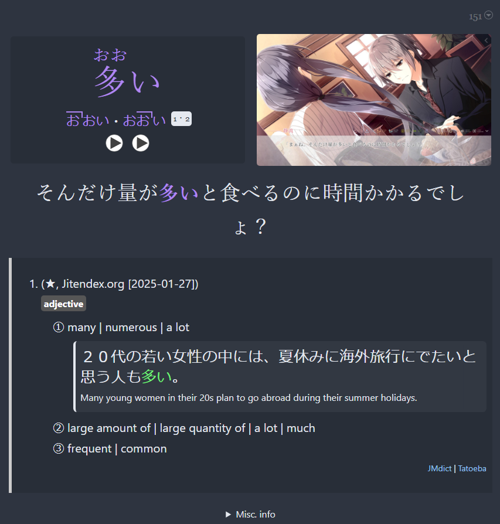
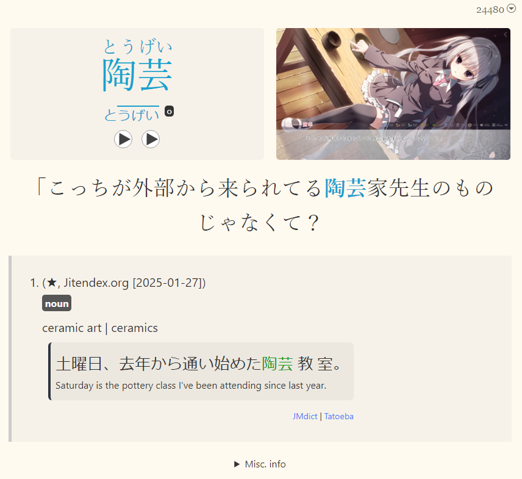
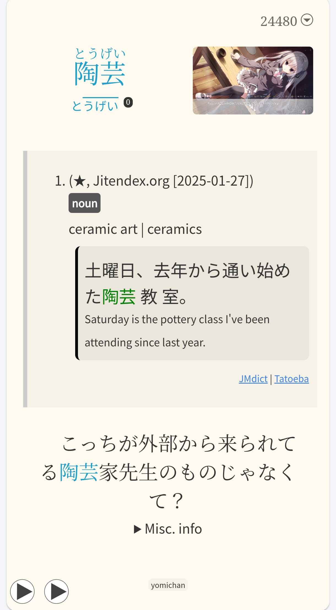

---
hide:
  - footer
---

??? note "What's the purpose of JP Lazy Guide? <small>(click here)</small>"

    - People who don't want to bother customizing their settings or knowing stuff technically
    - For people who want an all-in-one import and everything and done compared to other fully detailed guides but scattered tools
    - You want stable tools that lasts forever (If you don't update nothing will break)

    Do you want a very detailed guide instead of being spoonfed? Go to [Donkuri's Guide](https://donkuri.github.io/learn-japanese/)

---

New to Japanese and want to immerse quickly? See [Concise Guide to Jumpstart Japanese](conciseGuideToJumpstartJP.md)

---

## Anki and Yomitan Format

- 4 in 1 Profile Support: `Monolingual`, `Bilingual`, `Android (Anime, LN & Manga)`, `Android (VN)`

=== "Anki"
    === "PC | Dark"
        {height=300 width=600}
    === "PC | Light"
        {height=300 width=600}
    === "Mobile | Dark"
        {height=600 width=350}
    === "Mobile | Light"
        {height=600 width=350}
=== "Yomitan"
    === "Yomitan | Dark"
        {height=300 width=600}
    === "Yomitan | Light"
        {height=300 width=600}
    === "Yomitan Profile"
        {height=300 width=600}

---

## [Mining Demo](https://youtu.be/tUiXU2gn75g)

<iframe width="560" height="315" src="https://www.youtube.com/embed/tUiXU2gn75g" title="Mining Demo" frameborder="0" allow="accelerometer; autoplay; clipboard-write; encrypted-media; gyroscope; picture-in-picture; web-share" allowfullscreen></iframe>

[Proceed on Setup Guide](setup.md){ .md-button .md-button }