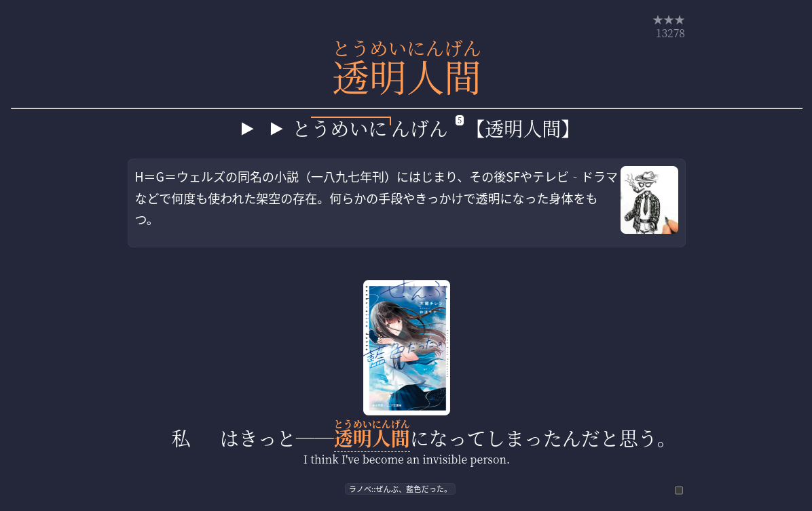
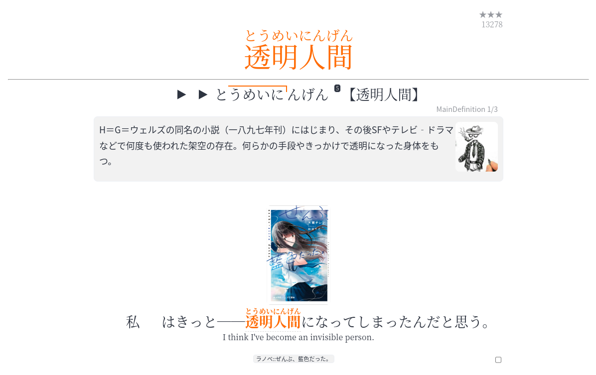
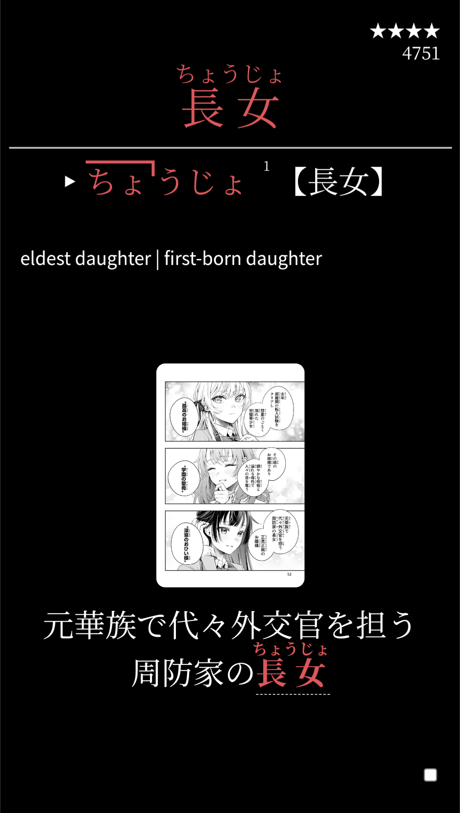
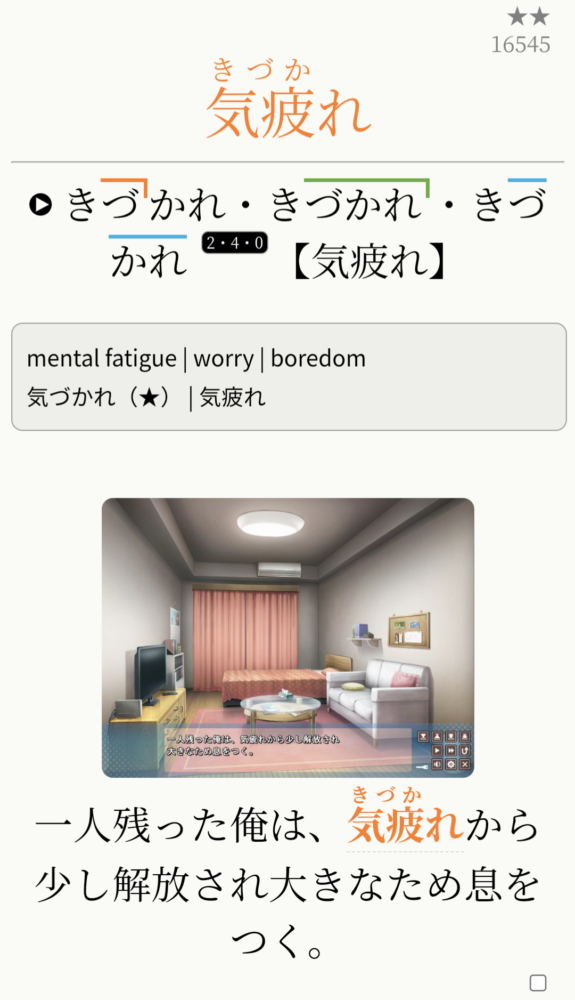
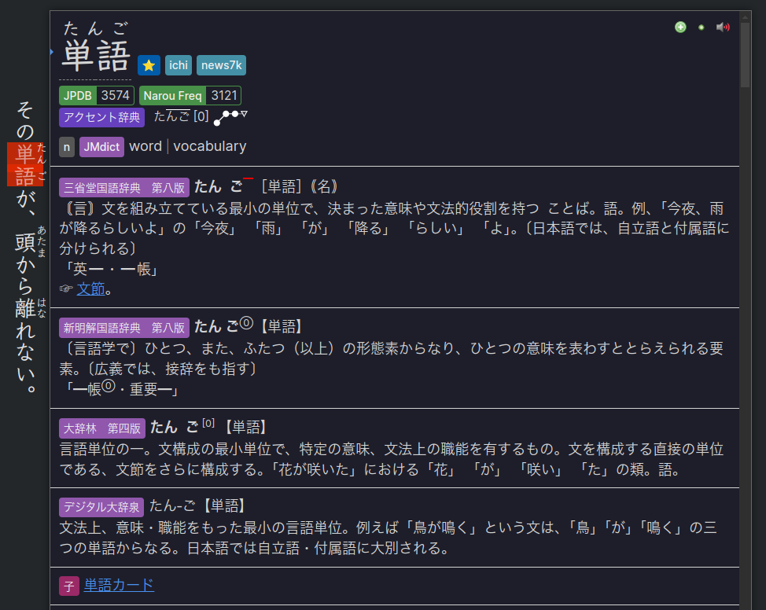
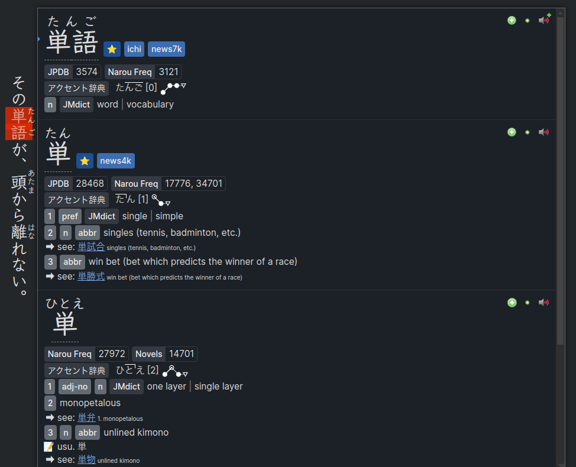

---
hide:
  - footer
---

Lazy Guide is based on a **plug-and-play** philosophy, designed for—

- People who don't want to bother customizing their settings or knowing stuff technically
- For people who want an all-in-one import and everything and done compared to other fully detailed guides but scattered tools
- You want stable tools that last forever (If you don't update nothing will break)

New to Japanese and want to immerse quickly? See [Concise Guide to Jumpstart Japanese](conciseGuideToJumpstartJP.md)

If you want to buy me a coffee (Thanks!): [Ko-fi (Xelieu)](https://ko-fi.com/xelieu)

Have any questions? Contact me or Ruri at Discord: [xelieu](https://www.discordapp.com/users/719459399168426054), [bewiz_]()
> **NOTE**: Neither Xelieu nor Ruri will entertain any questions that can be solved/answered by simply reading the guide. READ before asking. However, any suggestions and/or genuine questions will as always, be answered 😊

*Co-authored by Xelieu and Ruri* 瑠璃

> 📢: This setup works on ,  and , compatibility with  cannot be guaranteed.

---

## Anki and Yomitan Format

- 4 in 1 Profile Support: `Monolingual`, `Bilingual`, `LN & Manga in Android`, `VN in Android`

=== "Anki"
    === "PC | Dark"
        
    === "PC | Light"
        
    === "Mobile | Dark"
        {height=600 width=350}
    === "Mobile | Light"
        {height=600 width=350}
    > Note orignally made by [rudnam](https://github.com/rudnam) modified by Ruri to be more flexible and support [JPMN Handlebars](https://arbyste.github.io/jp-mining-note-prerelease/jpmnhandlebars/)
=== "Yomitan"
    === "Yomitan | Monolingual"
        {height=500 width=700}
    === "Yomitan | Bilingual"
        {height=500 width=700}

#### Notetype Features

??? note "Notetype Features <small>(click here)</small>"

    Here are the demos for `GUI` and `Field Customization`:

    - This comes `pre-configured` with the card and `you don't have to do anything`

    === "GUI"
        <video height="300" width="600"  controls>
        <source src="../vid/rudnamGUI.mp4" type="video/mp4">
        </video> 
        <ul>
          <li>`Hover over` any kanji in the word to see it's `definition and readings`</li>
          <li>Click on the `left` and `right` edges of the definition to `cycle` through your `MainDefinition`,`AuxiliaryDefinition` & `FullDefinition`</li>
          <li>Click on the `MainDefinitionPicture` or `Picture` to enlargen the image</li>
          <li>Click on `Show Translation` below the sentence to see it's translation (if applicable)</li>
          <li>See the `source material` of that card in the bottom</li>
          <li>Click on the `checkbox` in the `bottom-right` to reveal more details</li>
        </ul>
    === "Field Customization"
        <video height="300" width="600"  controls>
        <source src="../vid/rudnamFieldCustomization.mp4" type="video/mp4">
        </video>
        <li>By default the card is a `Vocab` Card
          <ul><li>Word on Front, Everything else on the Back</li></ul>
        </li>
        <li>Fill the `IsSentenceCard` field to make it a `Sentence` Card
          <ul><li>Sentence on Front, Everything else on the Back</li></ul>
        </li>
        <li>Fill the `IsHintCard` field to make it a `Hint/Kaishi` Card
          <ul><li>Word/Sentence as Hint on Front, Everything else on the Back</li></ul>
          <ul><li>This `card type` recommended to use for your Anki Reviews</li></ul>
        </li>
---

[Proceed on Setup Guide](setup.md){ .md-button .md-button }
