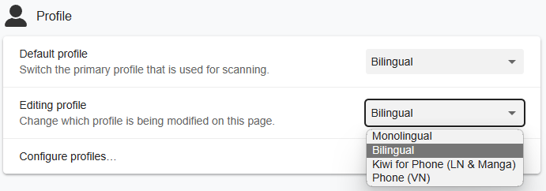

---
hide:
  - footer
---

JP Lazy Guide is for:

- People who don't want to bother customizing their settings or knowing stuff technically
- For people who want an all-in-one source compared to other fully detailed guides but scattered tools
- You want an import everything and done

New to Japanese and want to immerse quickly? see [Concise Guide to Jumpstart Japanese](conciseGuideToJumpstartJP.md)

If you want to buy me a coffee(Thanks!): [Ko-fi (Xelieu)](https://ko-fi.com/xelieu)

---

## Anki and Yomichan Format

- 4 in 1 Profile Support: `Monolingual`, `Bilingual`, `LN & Manga in Android`, `VN in Android`

=== "Anki | Dark"
    {height=300 width=600}
=== "Anki | Light"
    {height=300 width=600}
=== "Yomichan | Dark"
    {height=300 width=600}
=== "Yomichan | Light"
    {height=300 width=600}
=== "Yomichan Profile"
    {align=left height=300 width=600}

#### Anki Features

??? note "Anki Features <small>(click here)</small>"

    Here are the demos for `GUI`, `Card Creation` and `Field`:
        
    - This is `already configured` and `you don't have to do anything`
    
    === "GUI"
        <video height="300" width="600"  controls>
        <source src="../vid/jpmn-gui.mp4" type="video/mp4">
        </video>
    === "Card Creation"
        <video height="300" width="600"  controls>
        <source src="../vid/jpmn-card-creation.mp4" type="video/mp4">
        </video>
    === "Field Customization"
        <video height="300" width="600"  controls>
        <source src="../vid/jpmn-field.mp4" type="video/mp4">
        </video>
    
    [Source](https://aquafina-water-bottle.github.io/jp-mining-note/)

---

## [Mining Demo](https://youtu.be/seAMOvIiFcw)
- This is outdated `Anki/Yomichan Format` but the method is pretty much the same

<iframe width="560" height="315" src="https://www.youtube.com/embed/seAMOvIiFcw" title="Mining Demo" frameborder="0" allow="accelerometer; autoplay; clipboard-write; encrypted-media; gyroscope; picture-in-picture; web-share" allowfullscreen></iframe>

[Proceed on Setup Guide](setup.md){ .md-button .md-button }