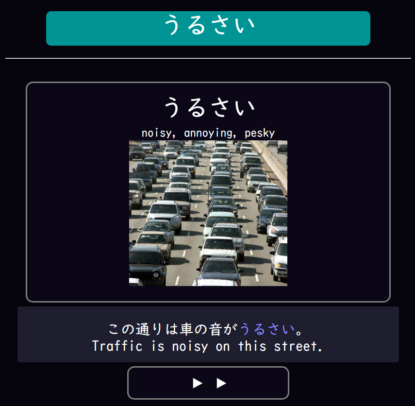

# Deck Resources

The following are a deck collection that I modified into modern design

---

## Modernized Core 2.3K Deck

Download [here](https://drive.google.com/drive/folders/17qxBZMmqNbDui1Ec6AP8HQnIUOvPSq8Y?usp=sharing)

Sample Format:

{height=250 width=500}

- Light/Dark/Mobile mode supported

- Based from [Anacreon's Core 2.3K Deck](https://anacreondjt.gitlab.io/docs/coredeck/)

- Existing users may update from copying [front](https://pastebin.com/nPRPFM3T), [back](https://pastebin.com/bsy5PfA7) and [styling](https://pastebin.com/iU1NwWbP)

---

## Modernized Kanken Deck

Download [here](https://drive.google.com/drive/folders/11II58wDTIVj-h5mbbexID59cXRxM8y10?usp=sharing)

Sample Format:

{height=250 width=500}

- Light/Dark/Mobile mode supported

- Based from [QuizMaster's Kanken Deck](https://ankiweb.net/shared/info/759825185)

- Existing users may update from copying [front](https://pastebin.com/eVeixh0S), [back](https://pastebin.com/pZsxaFqd) and [styling](https://pastebin.com/NuNpMdxX)
    - On `Anki`: `Browse` > `Under Decks`, click `漢字 Writing` > `Click on a card` then `Ctrl + A` or `select everything`
    - On `Toolbar`: `Notes` > `Find and Replace`
        Find: `<u>(?P<t>.*?)</u>`
        Replace With: `<b>$t</b>`
        In: `SentenceBack` and `SentenceFront`
        Selected notes only: `Checked`
        Ignore case: `Unchecked`
        Treat input as a regular expression: `Checked`
    - Apply it and it should be good