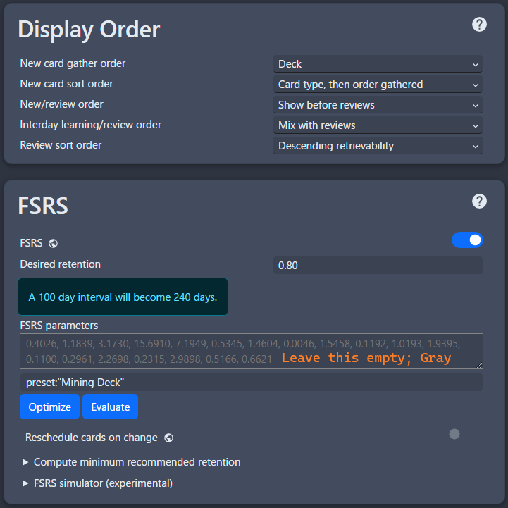
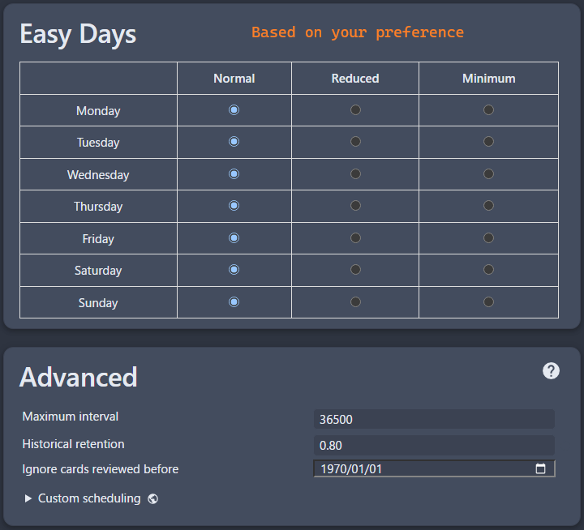

---
hide:
  - footer
---
# Retention How-to

If you are already using `FSRS`, no need to look at this guide except [Mining Pointers](retentionHowTo.md/#mining) as `FSRS` algorithm will adjust the settings automatically for you

This guide is `entirely my opinion`

Whenever you are making these changes, `please observe for a few weeks` before tweaking for more

The `settings matter less` the `further you go` in Japanese as `you'll get used to it` or know a lot to build upon from

---

## Mining

This is mostly beginner's pointers

1. Make sure you `only mine i+1` aka only 1 unknown kanji in the vocab or in the sentence it came from, that it should all makes sense but that 1 unknown

2. Try `avoiding rare words/very specific vocab words`(e.g. fantasy settings, if you know you won't read it again)

3. Usually, you can rep with just yomitan in the very common vocabs, try avoiding mining that, unless it took you ages and you still confuse it

---

## Anki Settings

I no longer recommend `microsteps` due to `FSRS`; this is worse case scenario

1. Use my settings, you can also try [microstep modified v2](https://github.com/LazyGuideJP/LazyGuideJP.github.io/blob/main/docs/img/microstep-v2.png) or [microstep modified v1](https://github.com/LazyGuideJP/LazyGuideJP.github.io/blob/main/docs/img/microstep-v1.png)
    - Shift + Click `options` on your deck to get this window

    ??? info "Anki Settings <small>(click here)</small>"
        === "Settings 1"
            {height=300 width=600}
        === "Settings 2"
            {height=300 width=600}
        === "Settings 3"
            {height=300 width=600}
        === "Settings 4"
            {height=300 width=600}
        === "Anki Preference Settings"
            {height=300 width=600}

2. Lapse, make your `leech threshold` down into `4-6` and `suspend card` instead of tag only

3. Use `micro steps`, my [microstep modified v2](https://github.com/LazyGuideJP/LazyGuideJP.github.io/blob/main/docs/img/microstep-v2.png) has it, it `eases recognizing new cards`

4. (Worse case scenario) `Decrease your new cards`, usually by `3-5` then `observe for a few weeks`

---

## General Suggestions

1. On `Anki` > `Custom Study` > `Review forgotten cards` > `1 day` only
    - I'd recommend `doing your anki first thing in the morning`, then doing this at night
    - It's good as it only takes `less than 5 minutes` since there's no step

2. You are actually honest; `if you forgot, you forgot`, it will be better in long term

---

## Anki Settings to tweak if above fails

In your `Deck`'s option:

1. Change `New Cards` > `Starting Ease` decrease to 30-50% each time then observe

2. Change `Reviews` > `Interval Modifier` by 10% plus or minus(lowest 90%) depending on your retention

---

## Anki Custom Algorithm: FSRS

1. Make sure you have `at least 3-6 months of stable anki data` as this algorithm analyses your memory
    - Creator mentions a `difference of 12.6%` compared to threshold and `18.1% against anki`
    
2. Its a little bit techy so here's a [full guide](https://github.com/open-spaced-repetition/fsrs4anki/blob/main/docs/tutorial.md)

---

## References

`Anki Settings` full explanation and add-ons: [AnimeCards Site](https://animecards.site/ankisetup/) and [Micro Steps Guide](https://cademcniven.com/posts/20210410/) for full explanation

- I'd recommend getting straight rewards and [AJT Mortician](https://ankiweb.net/shared/info/1255924302)(good for shortening time) if you didn't get my [Anki Add-Ons](https://drive.google.com/drive/folders/1dfmYAp0eg_bhhAkohUISYaS6B6QOBtww?usp=sharing)

- My [microstep modified v2](https://github.com/LazyGuideJP/LazyGuideJP.github.io/blob/main/docs/img/microstep-v2.png) is a modified version of [microstep modified v1](https://github.com/LazyGuideJP/LazyGuideJP.github.io/blob/main/docs/img/microstep-v1.png) and [this(original)](https://github.com/LazyGuideJP/LazyGuideJP.github.io/blob/main/docs/img/microstep-v0.png) from [Micro Steps Guide](https://cademcniven.com/posts/20210410/)

- My settings or Animecards settings works best if you are naturally good at memorizing, but if you're here, it probably didn't work