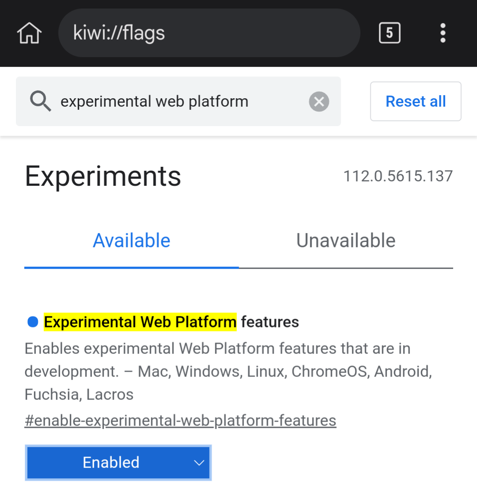
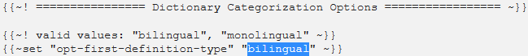

# Setup: Anime on Android

## Unfortunately...

There is still no proper tools to mine `Anime` automatically with `screenshot` and `audio` straight into `Anki` that can fully make use of `JPMN` Anki Format features

The nearest tool is: [Jidoujisho](https://github.com/lrorpilla/jidoujisho/releases/latest/), but you won't be able to use the `JPMN` Anki Features as it doesn't support `Yomichan Handlebar`

- I don't have `lazy guide` for this one as I refuse to mine without the full features of `JPMN` Anki Format

- Want to help out on this part? Message me on discord: [xelieu](https://www.discordapp.com/users/719459399168426054)

---

## Do you still persist?

I've actually tried `asbplayer` on `Android` but its pretty faulty and you cannot `screenshot`

- IT WORKS but BARELY, you'd rather not mine

??? note "Alright, show me the aBOmiNaTIoN! <small>(click here)</small>"

    - `asbplayer` is a browser video player that supports uploading of `Anime` and `subtitle` to be able hover over the words to use `Yomichan`

    ---

    ## Download and Install

    - Download your `Anime` and `JP Subtitle`
        - To get `JP subtitles` go to [kitsunekko](https://kitsunekko.net/dirlist.php?dir=subtitles%2Fjapanese%2F)

    Requirements

    - [Yomichan on Android](https://xelieu.github.io/jp-lazy-guide/setupYomichanOnAndroid/) already set-up

    ---

    ## Setting Up

    1. In your browser, go to `kiwi://flags`
        - Search for `Experimental Web Platform features` > `Enabled`

        {height=200 width=400}

    2. Go to [asbplayer](https://killergerbah.github.io/asbplayer/)
        - Ignore `request permission` to `Anki` and installing of `Chrome extension`

    3. Upload your `Anime` and `Subtitle` to the `asbplayer`

        === "Upload Files"
            {height=200 width=400}
        === "Pick Anime and Sub"
            {height=200 width=400}

    4. `Landscape` your `Android` to have a proper view of the `asbplayer`

    5. You can now mine with `Yomichan`
        - See [Anime Mining Demo](https://xelieu.github.io/jp-lazy-guide/setupAnimeOnPC/#info-1-anime-mining-demo)
        - Unfortunately, to get `Picture`, `screenshot` manually and upload it to your card details in `Ankidroid`

    Wow! Setting up the Mining tools is finally done, how about checking Sub Guide?

    [Proceed to Sub Guide](subGuide.md){ .md-button .md-button }

    ---

    ## Extra Info and Tips

    #### Info 1: Anime Mining Demo

    ??? info "Anime Mining Demo <small>(click here)</small>"

        <iframe width="560" height="315" src="https://www.youtube.com/embed/CujTp1DxbtM" title="Mining Demo" frameborder="0" allow="accelerometer; autoplay; clipboard-write; encrypted-media; gyroscope; picture-in-picture; web-share" allowfullscreen></iframe>

    #### Tip 1: Synchronizing Subtitle

    ??? tip "Synchronizing Subtitle <small>(click here)</small>"

        Depending on the source of your `Anime`, the `Subtitle` could be out of sync, to remedy that problem:

        - +100ms - `CTRL + SHIFT + LEFT ARROW KEY`

        - -100ms - `CTRL + SHIFT + RIGHT ARROW KEY`

    #### Tip 2: Skip Audio Recording when Mining

    ??? tip "Skip Audio Recording when Mining <small>(click here)</small>"

        - You can skip the audio recording when mining as it is time consuming

        - If you also manage to do your Anki Cards below 5s each, you will barely hear the recorded Audio

    ---

    ## FAQs

    #### Question 1: How to use Monolingual Setup on Android?

    ??? question "How to use Monolingual Setup on Android? <small>(click here)</small>"

        1. Go to your `Yomichan` settings > `Dictionary` > Enable `all`

            {height=250 width=500}

        2. `Yomichan` settings > `Anki` > `Configure Anki card templates...`
            - Switch the `highlighted text` to `monolingual` (case-sensitive)

            {height=250 width=500}

    #### Question 2: Why Enable Experimental Web Platform features?

    ??? question "Why Enable Experimental Web Platform features? <small>(click here)</small>"

        - Some `Anime` have multiple `audio sources` such as `en` and `jp`, by enabling this we can pick `jp` source if its not the default

    #### Question 3: Why Ignore Request Permission to Anki?

    ??? question "Why Ignore Request Permission to Anki? <small>(click here)</small>"

        - Because we are using the normal method where we can use the full features of `Anki` and `Yomichan` setup

    #### Question 4: Why not install the Chrome Extension?

    ??? question "Why not install the Chrome Extension? <small>(click here)</small>"

        - Same as `Question 2`, `asbplayer` has a built-in `Anki` support that lacks the feature of our own `Anki` and `Yomichan` support

Wow! Setting up the Mining tools is finally done, how about checking Sub Guide?

[Proceed to Sub Guide](subGuide.md){ .md-button .md-button }