# Setup: Anki

- Anki is a SRS flash card program for card reviewing and the due dates are decided by the algorithm
- Mobile is supported
- Anki [Light](../img/jpmn-light.png) | [Dark](../img/jpmn-dark.png) Mode

---

- Transferring from other Anki Format? 
    - Check [Transfer Existing Notes](https://aquafina-water-bottle.github.io/jp-mining-note/importing/) or [Transfer Lazy Format to JPMN](https://xelieu.github.io/jp-lazy-guide/transferAnkiSetup/)
- Updating your existing JPMN Format?
    - Go to [Updating: Anki JPMN Note](https://xelieu.github.io/jp-lazy-guide/updatingAnkiJPMNNote/)

---

## Download and Install

- Install `PC` [Anki Qt6](https://apps.ankiweb.net/) (Please don't use `Qt5`)
    - [Android](https://play.google.com/store/apps/details?id=com.ichi2.anki&hl=en_US) | [iOS](https://apps.apple.com/us/app/ankimobile-flashcards/id373493387) (Install guide is for `PC` only but you can use it on mobile afterwards)
- Download [Anki addons](https://drive.google.com/drive/folders/1qdElBZ_1CCjyVuKCrxHegtGYludG0HVw?usp=sharing)

---
## Setting Up
1. Open Anki and create an account and profile by clicking the `Sync` button

    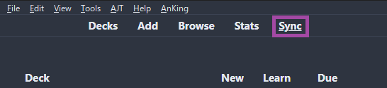{height=250 width=500}

2. Extract `Anki addons21.7z` and paste the `addons21` folder to `C:\Users\**YourUser**\AppData\Roaming\Anki2`
    
    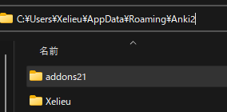{height=150 width=300}

3. Restart your Anki, then `Ctrl + Shift + A` OR `Tools` > `Add-ons` > `Check for add-ons update`
    - Update the `addons` then restart it again

    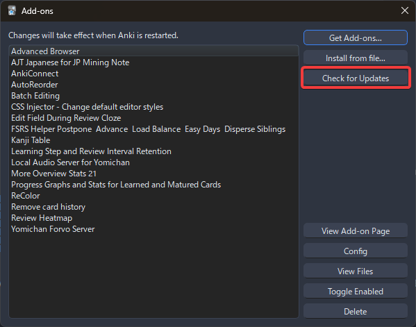{height=250 width=500}

4. In Anki: `Tools` > `JPMN Manager` > `Install jp-mining-note`
        
    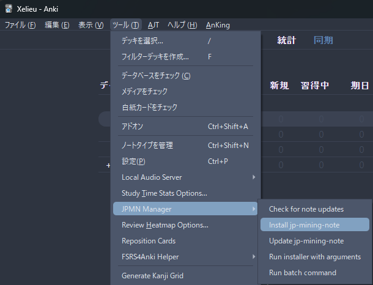{height=250 width=500}

5. Rename `JPMN-Examples` to `Mining Deck`

    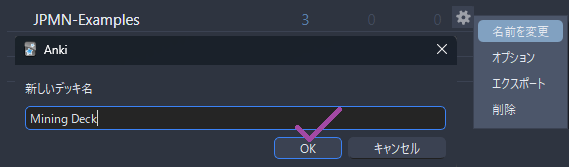{height=250 width=500}

6. Go to: `C:\Users\**YourUser**\AppData\Roaming\Anki2\**YourAnkiName**\collection.media`
    - Search `_jpmn-options`

        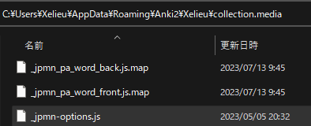{height=150 width=300}

    - Edit and save the config below (open in notepad)

        ??? examplecode "_jpmn-options config <small>(click here)</small>"

            ```
            window.JPMNOptions = {

                // Insert any runtime options here! They should be of the form:
                //
                //     "key": value,
                //
                // Some common examples are shown below.

                // Enables colored pitch accent
                "autoPitchAccent.coloredPitchAccent.enabled": true,

                // Enables image blur
                "imgStylizer.mainImage.blur.enabled": true,

                // Hides the first line of most definitions, as well as the number in the list
                "blockquotes.simplifyDefinitions.enabled": true,
            
            // ==========================================================================
                // = keybinds =
            // ==========================================================================

                // RESERVED KEYS (by anki):
                // - e (edit)
                // - r (replay)
                // - t (stats)
                // - y (sync)
                // - i (card info)
                // - o (options)
                // - a (add)
                // - s (idk exactly what this does tbh)
                // - d (deck)
                // - f (filtered deck options)
                // - v (play recorded voice)
                // - b (browse)
                // - m (menu)
                // - 1, 2, 3, 4 (again, hard, good, easy)
                // - 5 (pause audio)
                // - 6 (audio -5s)
                // - 7 (audio +5s)
                // - space (good)
                // - enter (good)
                //
                // RESERVED KEYS (by AJT Flexible grading):
                // - u (undo)
                // - h, j, k, l: hard / again / good / easy
                //
                // FREE KEYS:
                // - (left)  q w g z x c
                // - (right) p n 8 9 0 , . ; ' [ ]
                //
                // If you want to customize the keybinds, you must find the exact key code
                // that corresponds to your key. To do so, set "debug-level" to 0, press the
                // desired key(s), and look at the bottom of the debug log (under the info
                // circle) within the note. You may need to scroll down.

                "keybinds.enabled": true,

                // Keybind to toggle between showing the sentence and word on click and hover cards.
                // Equivalent to either clicking on the sentence/word on a click card,
                // or hovering over the word on a hover card.
                "keybinds.toggleHybridSentence": ["KeyN"],

                // Keybind to toggle between showing the tested word in a raw sentence card.
                // Equivalent to clicking on the "show" button.
                // This is the same as the above because both should never happen at the same time.
                "keybinds.toggleHighlightWord": ["KeyN"],

                // Keybind to toggle a vocab card's full sentence display (front side).
                // Techinically can be Shift / n as it doesn't interfere with the other two above.
                "keybinds.toggleFrontFullSentenceDisplay": ["Quote"],

                "keybinds.playSentenceAudio": ["KeyP"],

                "keybinds.playWordAudio": ["KeyR"],

                // Equivalent to toggling the hint show/hide
                "keybinds.toggleHintDisplay": ["Period"],

                "keybinds.toggleSecondaryDefinitionsDisplay": ["KeyQ"],

                "keybinds.toggleAdditionalNotesDisplay": ["BracketRight"],

                "keybinds.toggleExtraDefinitionsDisplay": ["KeyW"],

                "keybinds.toggleExtraInfoDisplay": ["BracketLeft"],
            }
            ```

7. In Anki: `Browse` > on the left side under `Note Type` > `JP Mining Note` > `Card...` > `Styling` > Scroll down to the bottom
    - Paste The Anki `Styling` config AFTER the `INSERT CUSTOM CSS BELOW` line
        - Editing only 1 card is enough for this to take effect on everything

    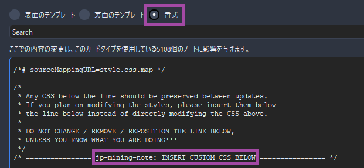{height=250 width=500}

    ??? examplecode "Anki Styling config <small>(click here)</small>"

        ```
        .glossary-text ol li[data-details="旺文社国語辞典 第十一版"] .dict-group__tag-list {
            display: none;
        }
        .glossary-text ol li[data-details="旺文社国語辞典 第十一版"] .dict-group__glossary--first-line {
            display: none;
        }
        .glossary-text ol li[data-details="旺文社国語辞典 第十一版"] .dict-group__glossary--first-line-break {
            display: none;
        }


        .glossary-text ol li[data-details="三省堂国語辞典　第七版"] .dict-group__tag-list {
            display: none;
        }
        .glossary-text ol li[data-details="三省堂国語辞典　第七版"] .dict-group__glossary--first-line {
            display: none;
        }
        .glossary-text ol li[data-details="三省堂国語辞典　第七版"] .dict-group__glossary--first-line-break {
            display: none;
        }


        .glossary-text ol li[data-details="実用日本語表現辞典"] .dict-group__tag-list {
            display: none;
        }
        .glossary-text ol li[data-details="実用日本語表現辞典"] .dict-group__glossary--first-line {
            display: none;
        }
        .glossary-text ol li[data-details="実用日本語表現辞典"] .dict-group__glossary--first-line-break {
            display: none;
        }


        .glossary-text ol li[data-details="新明解国語辞典　第八版"] .dict-group__tag-list {
            display: none;
        }
        .glossary-text ol li[data-details="新明解国語辞典　第八版"] .dict-group__glossary--first-line {
            display: none;
        }
        .glossary-text ol li[data-details="新明解国語辞典　第八版"] .dict-group__glossary--first-line-break {
            display: none;
        }


        .glossary-text ol li[data-details="明鏡国語辞典 第二版"] .dict-group__tag-list {
            display: none;
        }
        .glossary-text ol li[data-details="明鏡国語辞典 第二版"] .dict-group__glossary--first-line {
            display: none;
        }
        .glossary-text ol li[data-details="明鏡国語辞典 第二版"] .dict-group__glossary--first-line-break {
            display: none;
        }


        .glossary-text ol li[data-details="JMdict (English)"] .dict-group__tag-list {
            display: none;
        }
        .glossary-text ol li[data-details="JMdict (English)"] .dict-group__glossary--first-line {
            display: none;
        }
        .glossary-text ol li[data-details="JMdict (English)"] .dict-group__glossary--first-line-break {
            display: none;
        }


        .glossary-text--primary-definition ol {
            list-style: none;
            padding-left: 0em;
        }
        ```


8. Go to your `Deck`'s option then copy the `settings` below
    - (Top left) `Tools` > `Preferences` and set the settings accordingly
    - (Settings 3) Turn on `FSRS` with a minimum desired and SM2 retention of `0.80`, then use `Optimize FSRS Parameters` and `Compute Optimal Retention` every month
        - `Tools` > `FSRS4Anki Helper` for more personalized options like `Load Balancer`
        - Until `1000 reviews`, you can't generate your own parameters and you will be using the defaults

    === "Anki Preference Settings"
        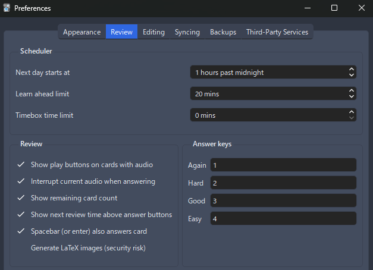{height=300 width=600}
    === "Settings 1"
        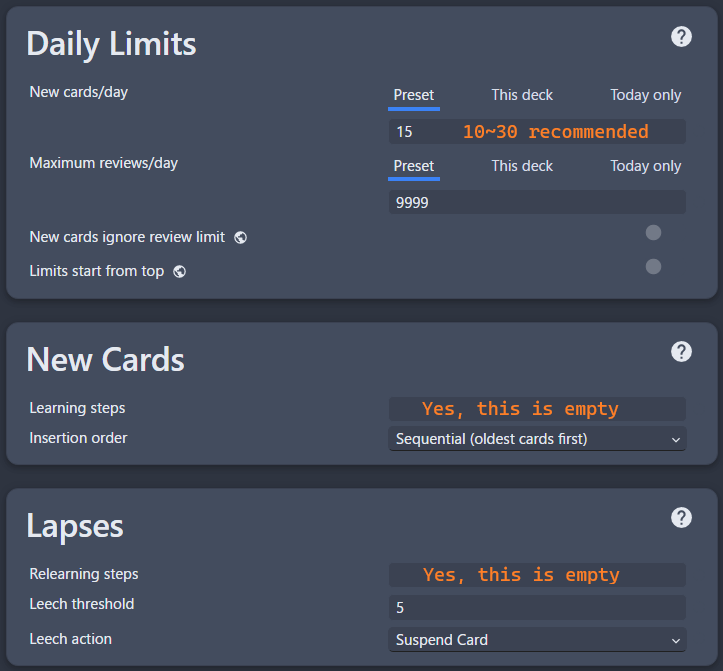{height=300 width=600}
    === "Settings 2"
        {height=300 width=600}
    === "Settings 3"
        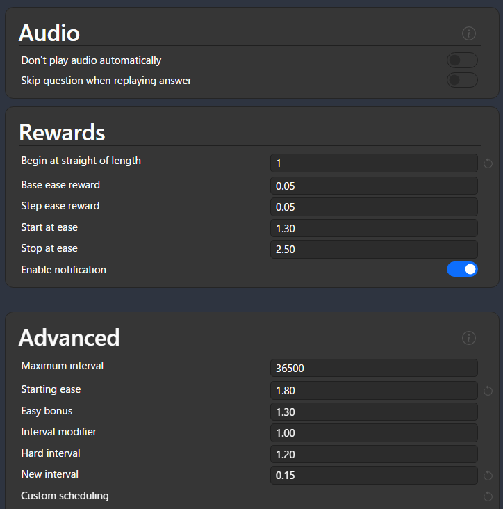{height=300 width=600}

9. Restart your `Anki` and it should be good to go

You now have an Anki Template, next is Yomitan

[Proceed to Yomitan Setup](setupYomitanOnPC.md){ .md-button .md-button }

<small>If you have any problems check [FAQs](https://xelieu.github.io/jp-lazy-guide/setupAnki/#faqs) or contact me on Discord: [xelieu](https://www.discordapp.com/users/719459399168426054)</small>

---

## Extra Info and Tips

#### Info 1: Anki Add-ons List

??? info "Anki Add-ons List <small>(click here)</small>"

    Here's the list of Anki Add-ons:

    - You can search them by clicking `View Add-on Page` to know more about them
    - Most of them are in `Tools` in the `Taskbar`

    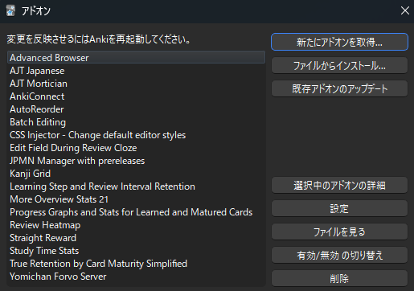{height=250 width=500}

#### Info 2: Anki Light and Dark Mode

??? info "Anki Light and Dark Mode <small>(click here)</small>"

    To change the anki theme, go to `Tools` > `Preferences` > `Theme`

    {height=300 width=600}

#### Info 3: Retention How To

??? info "Retention How To <small>(click here)</small>"

    If you found yourself having low retention, go to [Retention How-To](https://xelieu.github.io/jp-lazy-guide/retentionHowTo/) for anki settings suggestions and other tips

#### Tip 1: When Reviewing on Anki

??? tip "When Reviewing on Anki <small>(click here)</small>"

    - When doing Anki just use `again (1)` or `good (spacebar or 3)` button so you don't have to think about if it's `easy (2)` or `hard (4)`

#### Tip 2: Anki Keyboard Shortcuts

??? tip "Anki Keyboard Shortcuts <small>(click here)</small>"

    When viewing a card, you can use shortcuts to expand for more info:

    - `Q` : `Secondary Definition`
    - `W` : `Extra Definition`
    - `[` : `Extra Info`

#### Tip 3: Anki Pitch Accent Color

??? tip "Anki Pitch Accent Color <small>(click here)</small>"

    When viewing a card, they are color assigned with the following:

    {height=250 width=500}

## FAQs

#### Question 1: Where should I put more image aside from screenshot?

??? question "Where should I put more image aside from screenshot <small>(click here)</small>"

    - Put it in `PrimaryDefinitionPicture` in `Anki`

    - You can paste the image while reviewing by going `Edit` mode or `E` shortcut

#### Question 2: Where can I ask if something is wrong with my JPMN Anki Format?

??? question "Where can I ask if something is wrong with my JPMN Anki Format? <small>(click here)</small>"

    - In [JPMN's FAQ & Troubleshooting](https://aquafina-water-bottle.github.io/jp-mining-note/faq/) page

#### Question 3: How to change the styling like font or size?

??? question "How to change the styling like font or size? <small>(click here)</small>"

    - In the same way as `Step 7`, on the card's `styling` tab

    - Scroll down until you find `/* ================ jp-mining-note: INSERT CUSTOM CSS BELOW ================ */`

    - Changing anything not below that specific `line of code` will be reverted back once you `updated` the `note`

#### Question 4: Can I rename the deck?

??? question "Can I rename the deck? <small>(click here)</small>"

    - Technically yes, but I wouldn't recommend; you have to resetup Yomitan's `Anki Card Format` and Anki's Add-on `AutoReorder`
