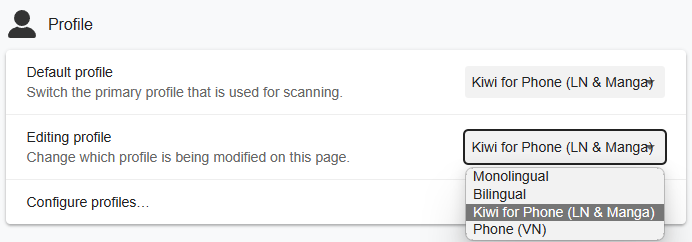
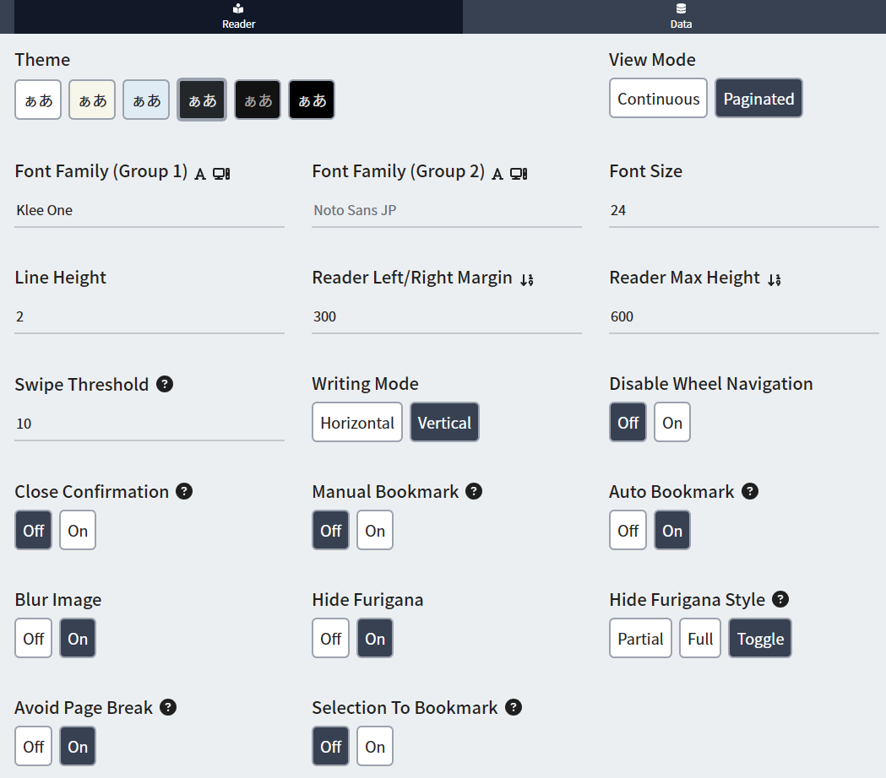

# Setup: LN on Android

- You can use your `Android` to read `Light Novel` using `Kiwi Browser` to scan words using `Yomichan` on it

---

## Download and Install

- Download and Install [Ankiconnect Android](https://drive.google.com/drive/folders/1LG1e4mUmBivgW_ebaP0M2HljlHVclNEg?usp=sharing)

- Install [Ankidroid](https://play.google.com/store/apps/details?id=com.ichi2.anki)

- Install [Kiwi Browser](https://play.google.com/store/apps/details?id=com.kiwibrowser.browser&hl=en_US)
    - (Optional) In `Kiwi Browser` Download [Violentmonkey](https://chrome.google.com/webstore/detail/violentmonkey/jinjaccalgkegednnccohejagnlnfdag) and Install [Reading Speed Indicator](https://greasyfork.org/en/scripts/459921-reading-speed-statistics-ttsu-app)
    - (Optional) In `Kiwi Browser` Download [Fullscreen](https://chrome.google.com/webstore/detail/fullscreen/lbpgkagpackldbkfookmmdpfaolnoged) Extension

---

## Setting Up

`Yomichan` installed in `Kiwi Browser`, same setup as Chrome [here](https://xelieu.github.io/jp-lazy-guide/jp-lazy-guide/setupYomichan/#download-and-install)

1. Open `AnkiConnect Android`, start the service
    - Open `Ankidroid` and leave it in the background

2. Open your `Kiwi Browser` > `Yomichan Settings` > `Profile` > `Default` & `Editing` Profile > `Kiwi for Phone (LN & Manga)`
    - If you are not using my `yomichan settings`, see [Info 1](https://xelieu.github.io/jp-lazy-guide/jp-lazy-guide/setupLnOnAndroid/#info-2-text-replacement-pattern)

    {height=250 width=500}

3. In `Kiwi Browser`, open `https://reader.ttsu.app/` and upload your `Light Novel` epubs

4. You can now `mine` in `Android`

    {height=150 width=300}

You can now read Light Novels in Android, why not check out the Manga setup?

[Proceed to Manga on PC Setup](setupMangaOnPC.md){ .md-button .md-button }

---

## Extra Info and Tips

#### Info 1: My TTU Settings

??? info "My TTU Settings <small>(click here)</small>"
    Here's my `Android` settings for `TTU`

    {height=500 width=1000}

#### Info 2: Text Replacement Pattern

??? info "Text Replacement Pattern <small>(click here)</small>"

    Without my settings, you have to manually put this as it is needed to accurately scan text

    1. On `yomichan settings` > turn on `Advanced` settings, either `bottom left` or `scroll down`

    2. On `Translation` > `Configure custom text replacement patterns...`

    3. Copy and paste [this](https://pastebin.com/tzHgVe6V)

#### Info 3: Android Yoomichan Local Audio

??? info "Android Yoomichan Local Audio <small>(click here)</small>"

    Requirements:
    
    - Make sure you have [PC Yomichan Local Audio](https://xelieu.github.io/jp-lazy-guide/jp-lazy-guide/setupYomichan/#info-2-yomichan-local-audio) setup

    - You have [AnkiConnect Android](https://drive.google.com/drive/folders/1LG1e4mUmBivgW_ebaP0M2HljlHVclNEg?usp=sharing) installed

    - Here's the [source](https://github.com/Aquafina-water-bottle/AnkiconnectAndroid/tree/local_audio#additional-instructions-local-audio) for more info or updates

    - This setup takes **3gb+** of space

    ---

    1. Within `Anki` on `PC`: `Tools` > `Local Audio Server` > `Generate Android database`
        - This would take 30mins+ (Anki will be unuseable but you can mine)
    
    2. Within `Anki` on `PC`: either `Ctrl + Shift + A` or `Tools` > `Add-ons` > select `Local Audio Server for Yomichan` > `View Files`
        - There will be a file named `android` or `android.db`

    3. On your phone, open `AnkiConnect Android` > `Settings` > `Print Local Audio Directory`
        - This will show you the path as well as generate the folder
    
    4. On that location from 3rd step, usually: `Android/data/com.kamwithk.ankiconnectandroid/files/`
        - Paste the `android` file ON `files` folder from `PC` (2nd step)
        - The result should be: `Android/data/com.kamwithk.ankiconnectandroid/files/android.db`
    
    5. My `local-audio-yomichan-settings` profile: `Kiwi for Phone (LN & Manga)`
        - OR if you are not using my profile:
            - Go to `yomichan settings` > `Audio` > `Configure audio playback sources...` > `Add` > `Custom URL (JSON)`
            - Paste `http://localhost:8765/localaudio/get/?term={term}&reading={reading}` and make sure it's on the top
    
    6. To ensure its working, check that all sources are present
        - If it doesn't work, make sure AnkiConnect Android `Start Service` is running
        - Battery saving/optimization is off for AnkiConnect Android, Ankidroid and Kiwi Browser

        {height=250 width=500}

        DONE!