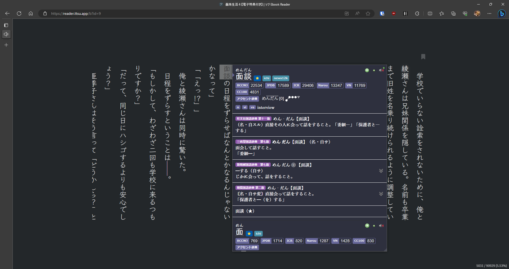
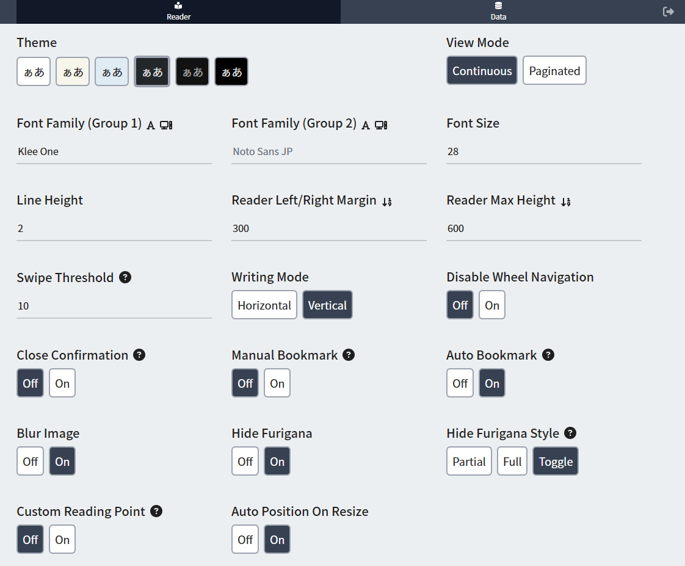

# Setup: LN on PC

- You can read `Light Novel` on `PC` as long as you have `epubs` of the `Light Novel` and a website to use the `epubs` on and use `Yomichan`

---

## Requirements

- Download `Light Novel` in `epubs` format of your choice

- [Yomichan On PC](https://xelieu.github.io/jp-lazy-guide/setupYomichanOnPC/) already set-up

---

## Setting Up

1. In your `browser`, go to `https://reader.ttsu.app/`

    {height=500 width=1000}

2. Upload a `File` or `Folder` containing `LN epubs`

    {height=50 width=100}

3. You can now mine using `Yomichan` as usual

    {height=500 width=1000}

You can now read Light Novels on PC, how about Android?

[Proceed to LN on Android Setup](setupLnOnAndroid.md){ .md-button .md-button }

<small>If you have any problems check [FAQs](https://xelieu.github.io/jp-lazy-guide/setupLnOnPC/#faqs) or contact me on Discord: [xelieu](https://www.discordapp.com/users/719459399168426054)</small>

---

## Extra Info and Tips

#### Info 1: My TTU Settings

??? info "My TTU Settings <small>(click here)</small>"
    Here's my `PC` settings for `TTU`

    {height=500 width=1000}

#### Info 2: Text Replacement Pattern

??? info "Text Replacement Pattern <small>(click here)</small>"

    Without my settings, you have to manually put this as it is needed to accurately scan text

    1. On `yomichan settings` > turn on `Advanced` settings, either `bottom left` or `scroll down`

    2. On `Translation` > `Configure custom text replacement patterns...`

    3. Copy and paste [this](https://pastebin.com/tzHgVe6V)

#### Tip 1: Getting epubs

??? tip "Getting epubs <small>(click here)</small>"

    To get epubs, search around the web, go to `nyaa` or discord servers that have them or `BUY` and convert them

    - If you pm me, I can give you more details

---

## FAQs