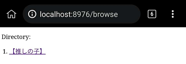
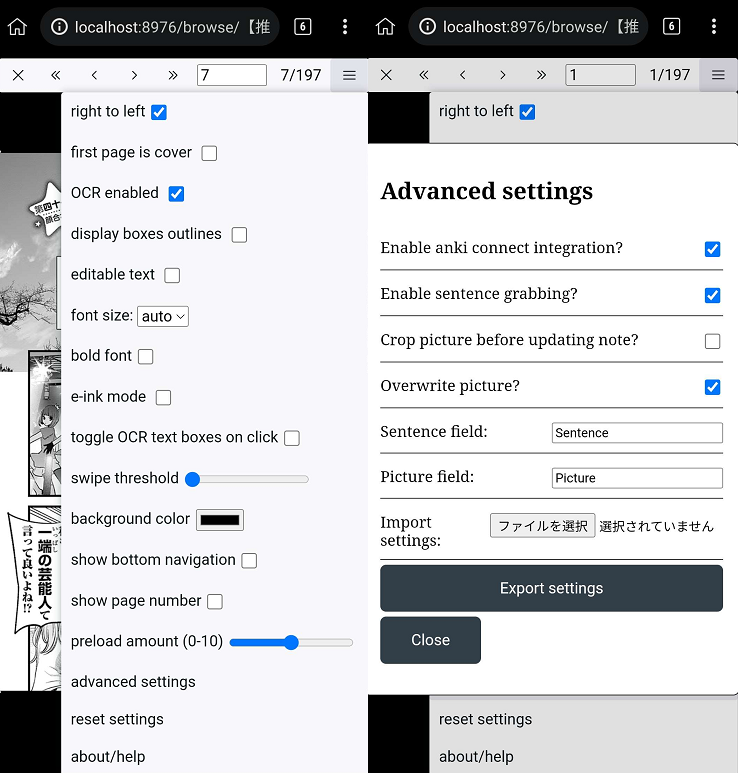

# Setup: Manga on Android

- You can use your `Android` to read `Manga` using `Kiwi Browser` to scan words using `Yomichan` on it

- This includes automated `Manga` screenshot even if you are in `Android`

---

## Download and Install

- Download and Install `Ankiconnect Android` and `Local File Server` from [here](https://drive.google.com/drive/folders/1LG1e4mUmBivgW_ebaP0M2HljlHVclNEg?usp=sharing)

- Install [Ankidroid](https://play.google.com/store/apps/details?id=com.ichi2.anki)

- Install [Kiwi Browser](https://play.google.com/store/apps/details?id=com.kiwibrowser.browser&hl=en_US)

Requirements:

- Processed Manga from [Setup: Mokuro Manga](https://xelieu.github.io/jp-lazy-guide/jp-lazy-guide/setupMangaOnPC/#setup-mokuro-manga)

---

## Setting Up

`Yomichan` installed in `Kiwi Browser`, same setup as Chrome [here](https://xelieu.github.io/jp-lazy-guide/jp-lazy-guide/setupYomichan/#download-and-install)

1. Transfer your `Processed Manga` in `~/Android/data/com.rayrtheii.localfileserver/files/`

2. Open `Ankiconnect Android` > `settings` > `CORS Host` > `http://localhost:8976`

    {height=200 width=400}

3. `Start the Service` on both `AnkiConnect Android` and `Local File Server`

4. Open your `Kiwi Browser` > http://localhost:8976/browse > Manga's `.html` file

    {height=150 width=300}

5. Go to `settings` > `advanced settings` then copy this:

    {height=500 width=1000}

    - Uncheck the `show page number` so it doesn't get included on mining
    - `Export your settings` as every time you have new manga/volume you need to re-import the settings

??? info "Android Manga Mining Demo <small>(click here)</small>"

    {height=200 width=400}

You are now finally done in setting up Manga Mining in Android, how about checking out Anime Mining?

[Proceed to Setup: Anime on PC Setup](setupAnimeOnPC.md){ .md-button .md-button }

---

## Extra Info and Tips