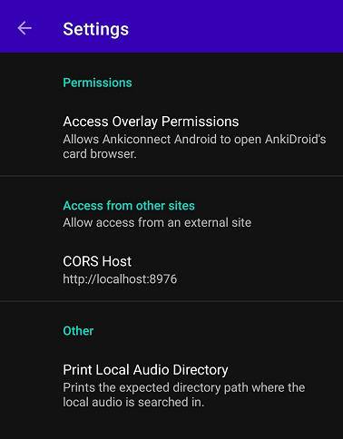
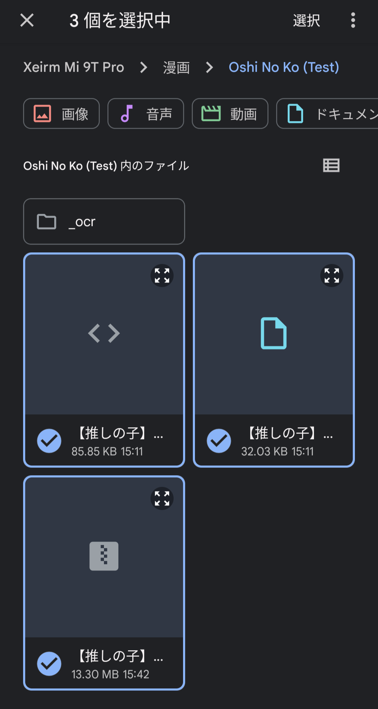

# Setup: Manga on Android

- You can use your `Android` to read `Manga` using `Kiwi Browser` to scan words using `yomitan` on it

- This includes automated `Manga` screenshot even if you are in `Android`

---

## Download and Install

- Download and Install [Ankiconnect Android](https://github.com/KamWithK/AnkiconnectAndroid/releases/latest/) in Assets `.apk` file

- Install [Ankidroid](https://play.google.com/store/apps/details?id=com.ichi2.anki)

- Install [Kiwi Browser](https://play.google.com/store/apps/details?id=com.kiwibrowser.browser&hl=en_US)

Requirements:

- Processed Manga from [Setup: Mokuro Manga](https://xelieu.github.io/jp-lazy-guide/setupMangaOnPC/#setup-mokuro-manga)

- [Yomitan On Android](https://xelieu.github.io/jp-lazy-guide/setupYomitanOnAndroid/) already set-up

- File compressor such as [7z](https://www.7-zip.org/)

---

## Setting Up

1. Compress your Manga files(the one that contain `img` or `.png` files) into `.zip` format NOT `.7z`
    - To compress, `Right click` on the folder > `7-Zip` > `Compress...` > `Archive Format: .zip` > `OK`

2. Transfer your `Processed Manga` to your `Android` Device
    - ALL the files, the compressed `manga` .zip file itself, `_ocr` and `.mokuro` file

3. Open `Ankiconnect Android` > `settings` > `CORS Host` > `https://reader.mokuro.app`

    {height=200 width=400}

4. `Start the Service` on `AnkiConnect Android` and make sure `AnkiDroid` is also opened

5. Open your `Kiwi Browser` > go to [Mokuro Reader](https://reader.mokuro.app/) > `Upload` icon (top right) > `choose files`
    - Go to the directory of your manga and upload `.html`, `.mokuro` and `.zip` files (from `Step 2`)

    {height=150 width=300}

6. In the top right, go to `settings` > `Profile` > `Select a File` > [Mokuro Profile](https://drive.google.com/drive/folders/1vX40zrvkGN13o_3WRYzqP1-L0F8mX6JJ?usp=sharing) > `Import Profiles` > Select `Mobile Profle`
    - Alternatively you can make your own profile just make sure to set-up everything on `Anki Connect` portion

7. To be able to mine, simply add the word using `Yomitan`
    - To screenshot, make sure to double click/tap inside the `text border` (its invisible by default)

    {height=400 width=800}

8. You should now be able to mine and screenshot in your Manga with ease

You are now finally done in setting up Manga Mining in Android, how about checking out Anime Mining?

[Proceed to Setup: Anime on PC Setup](setupAnimeOnPC.md){ .md-button .md-button }

<small>If you have any problems check [FAQs](https://xelieu.github.io/jp-lazy-guide/setupMangaOnAndroid/#faqs) or contact me on Discord: [xelieu](https://www.discordapp.com/users/719459399168426054)</small>

---

## Extra Info and Tips

#### Info 1: Android Mining Demo

??? info "Android Mining Demo <small>(click here)</small>"

    - Mining Demo with Manga screenshot
    - This is `outdated` but shows the fundamental function
    - To actually screenshot you need to double tap or hold tap on the `text border`

    {height=200 width=400}s

#### Tip 1: Export your Settings

??? tip "Export your settings <small>(click here)</small>"

    - `Export your settings` as every time you have new manga/volume you need to re-import the settings

## FAQs

#### Question 1: How to use Monolingual Setup on Android?

??? question "How to use Monolingual Setup on Android? <small>(click here)</small>"

    1. Go to your `Yomitan` settings > `Dictionary` > Enable `all`

        {height=250 width=500}

    2. `Yomitan` settings > `Anki` > `Configure Anki card templates...`
        - Switch the `highlighted text` to `monolingual` (case-sensitive)

        {height=250 width=500}