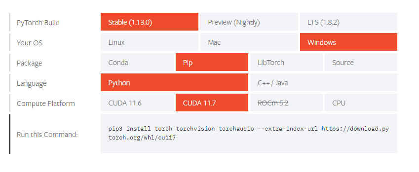
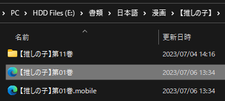

# Setup: Manga on PC

- [MangaOCR](https://xelieu.github.io/jp-lazy-guide/setupMangaOnPC/#setup-mangaocr) is a tool used to scan a `Japanese` text and return it to your clipboard which you can scan in `Yomichan`

- (Recommended) [Mokuro Manga](https://xelieu.github.io/jp-lazy-guide/setupMangaOnPC/#setup-mokuro-manga) is a setup that first processes the `manga` to be able to hover the words and scan them using `Yomichan`

---

## MangaOCR

Requirements

- Install [CDisplay](https://www.cdisplay.me/)
    - Manga Reader for `PC`
- [Yomichan On PC](https://xelieu.github.io/jp-lazy-guide/setupYomichanOnPC/) and [ShareX](https://xelieu.github.io/jp-lazy-guide/setupShareX/) already set-up

---

## Setup: MangaOCR

1. Download [python](https://www.python.org/downloads/release/python-31011/)
    - Then choose Windows/mac `INSTALLER (64-bit)` and install
    - Check `Add Python to Path`

2. Open `command prompt` by winkey/search > cmd

3. Type `pip3 install manga-ocr`
    - Then just let it download/install for a few mins until its done and you can type again
    - If `pip3 is not recognized...` then just `uninstall Python` > `restart` > `install Python` (repeat if it didn't work)

4. Either Type `manga_ocr` or `manga_ocr "\path\to\sharex\screenshot\folder"`(OCR from a folder only) to start the program, then just minimize the window
    - If you want a `shortcut` program see: [Info 1](https://xelieu.github.io/jp-lazy-guide/setupMangaOnPC/#info-1-mangaocr-shortcut-program)

5. Capture anything using `Shift + Alt + Q` or whatever you set in `OCR (manga_ocr)` hotkey in `ShareX`
    - Make sure Yomichan Search window is opened
    - If you want to `scan using mouse button`, see [Info 2](https://xelieu.github.io/jp-lazy-guide/setupMangaOnPC/#info-2-scan-using-mouse-button)

    ??? info "Video How-to"
        <iframe width="560" height="315" src="https://user-images.githubusercontent.com/22717958/150238361-052b95d1-0152-485f-a441-48a957536239.mp4" title="MangaOCR How-to" frameborder="0" allow="accelerometer; autoplay; clipboard-write; encrypted-media; gyroscope; picture-in-picture; web-share" allowfullscreen></iframe>

    === "Yomichan Search Page"
        {height=300 width=600}
    === "CDisplay Manga"
        {height=300 width=600}

6. See [Reading Processed Manga](https://xelieu.github.io/jp-lazy-guide/setupMangaOnPC/#reading-processed-manga)

That's it for MangaOCR!

---

## Setup: Mokuro Manga

Choose between 2 options:

- [Online Processing Method](https://xelieu.github.io/jp-lazy-guide/setupMangaOnPC/#online-processing-method): ~15mins per 200 manga pages; straightforward guide; doesn't support ZXY fork of mokuro

- [Local Processing Method](https://xelieu.github.io/jp-lazy-guide/setupMangaOnPC/#local-processing-method): If you have a `strong PC` this is better; you are also `a know-how`

!!! note "Android Mining"

    To be able to mine in `Android` check: [Setup: Manga On Android](https://xelieu.github.io/jp-lazy-guide/setupMangaOnAndroid/)

---

### Online Processing Method

1. Follow this [Setup Guide](https://colab.research.google.com/drive/1zT4ubIPs3J93UJ0Di82A1ZimzXYULXNf?usp=sharing)

2. Download the processed `Manga` folder and see [Reading Processed Manga](https://xelieu.github.io/jp-lazy-guide/setupMangaOnPC/#reading-processed-manga)

---

### Local Processing Method

1. Download [python](https://www.python.org/downloads/release/python-31011/)
    - Then choose Windows/mac `INSTALLER 64bit` and install
    - Check `Add Python to Path`

2. Download and Install [Git](https://github.com/git-for-windows/git/releases/download/v2.40.1.windows.1/Git-2.40.1-64-bit.exe)

3. Open `command prompt` by winkey/search > cmd

4. Type `pip install git+https://github.com/ZXY101/mokuro.git@master`
    - Then just let it download/install for a few mins until its done and you can type again
    - If `pip3 is not recognized...` then just uninstall > restart > install Python repeatedly (I know its dumb but that's how)

5. (Optional) Use `GPU CUDA`
    - Check if your GPU is [CUDA compatible](https://developer.nvidia.com/cuda-gpus)
    - Download [CUDA package](https://developer.nvidia.com/cuda-downloads)
    - Type `pip3 install torch torchvision torchaudio --extra-index-url https://download.pytorch.org/whl/cu117` in `cmd` or go [here](https://pytorch.org/get-started/locally/#start-locally) for updated version

    {height=300 width=600}

    - To check if its existing, type `python` > `import torch` > `torch.cuda.is_available()`

        {height=150 width=300}

    - If it redirects you to Microsoft Store: Open `Windows Powershell` > `input Remove-Item $env:USERPROFILE\AppData\Local\Microsoft\WindowsApps\python*.exe` > `enter`
    - If problem occurs reinstall pytorch by `pip uninstall torch` then redo the step above and update to the latest if its after `CUDA 11.7`, if still failed, go [here](https://pytorch.org/get-started/locally/#windows-verification)

6. Two options to process, go to `cmd` then:
    - Specified Manga volume: Type `mokuro F:\Manga\Saenai\Vol3` (Replace full directory, Saenai and volume #)
    - All Manga volumes: Type `mokuro --parent_dir F:\Manga\Saenai` (Replace full directory, Saenai with your manga name)
        - Your vol1, 2, 3, etc. should be inside `Saenai folder` in ascending uniform named order

7. See [Reading Processed Manga](https://xelieu.github.io/jp-lazy-guide/setupMangaOnPC/#reading-processed-manga)

---

### Reading Processed Manga

1. In your `Manga` folder after and open the `.html` file

    {height=150 width=300}

2. You can now hover over the `words` to use `Yomichan` like usual
    - Use `ShareX` hotkeys to `screenshot`

    {height=300 width=600}

!!! note "_ocr folder"

    ocr files is optional but recommended to keep

You can now mine Manga on PC, see how its done in Android!

[Proceed to Manga on Android Setup](setupMangaOnAndroid.md){ .md-button .md-button }

## Extra Info and Tips

#### Info 1: MangaOCR Shortcut Program

??? info "MangaOCR Shortcut Program <small>(click here)</small>"
    1. `Right click` in an empty space in your `Desktop` > `New` > `Shortcut`

        {height=300 width=600}

    2. Type the location of the item as:
        - Default: `C:\Windows\System32\cmd.exe /k manga_ocr`
        - OCR only from specific folder: `C:\Windows\System32\cmd.exe /k manga_ocr "\path\to\the\screenshot\folder"`
            - For example: `C:\Windows\System32\cmd.exe /k manga_ocr "F:\Pictures\OCR Picture"`
            - `Next` then `choose your name` and done

#### Info 2: Scan using Mouse Button

??? info "Scan using Mouse Button <small>(click here)</small>"
    1. Download and install [AutoHotkey](https://www.autohotkey.com/)

    2. Download my [Hotkey](https://drive.google.com/drive/folders/1bIgKmWubUvipRyymsvhvLCtoQYSUD1q3?usp=sharing) then run it

    3. Use `Forward Button` to use it
        - This is assuming the `OCR (manga_ocr)` hotkey in `ShareX` is unchanged from `Shift + Alt + Q`
        - You can edit the hotkey by editing the script if you like

#### Tip 1: Getting raw or Processed Manga

??? tip "Getting raw or Processed Manga <small>(click here)</small>"

    To get epubs, search around the web, go to `nyaa` or discord servers that have them or `BUY` and convert them

    To get Processed Manga, check out [TMW](https://learnjapanese.moe/join/) and ask from there

    - If you pm me, I can give you more details