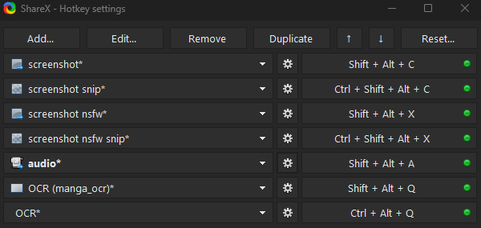

# Setup: ShareX

- ShareX is a automated tool used to `screenshot`, `audio record` and `OCR` to be pasted in `Anki` Cards conveniently
- `Required for mining` to anything that I use

---

## Download and Install

- Install [ShareX](https://getsharex.com/)
- Download [lazyXel-ShareX-15.0.0-backup](https://drive.google.com/drive/folders/1WGmVeT6pdip-LK8asqi_cF3OC0lvNylL?usp=sharing)

---

## Setting Up

1. In `ShareX` > `Application Settings` > `Settings` > `Import` > `lazyXel-ShareX-15.0.0-backup`
    - Ignore the random name files(its empty), its a residue files that can't be removed upon export

2. In `ShareX` > `Hotkey Settings` > Change the keybinds/name if you like

    {height=300 width=600}

3. `Hotkey Settings` > `screenshot`, `screenshot snip`, `screenshot nsfw`, `screenshot nsfw snip` and `audio` > `override screenshot folder` > change the `path` for each one

    {height=150 width=300}

4. For `audio`: `Hotkey settings` > `audio` > `screen recorder` > `screen recorder options`
    - Install `recorder devices`
    - Video source: `none`
    - Audio source: `virtual-audio-capturer`

You are done setting up ShareX, next is Visual Novel for PC

[Proceed to VN on PC Setup](setupVnOnPC.md){ .md-button .md-button }

---

## Extra Info and Tips

??? info "Hotkey Function <small>(click here)</small>"

    - `screenshot` and `screenshot nsfw`: Captures your whole main screen
        - If you want to edit which monitor: `Hotkey settings` > `screenshot` > `Capture` > `Select region...`

    - `screenshot snip` and `screenshot nsfw snip`: Captures the region that you specify, similar to cropping

    - `OCR (manga_ocr)` is used in [Manga OCR]() while `OCR` is your default ShareX OCR

#### Tip 1: Skip Audio Recording when Mining

??? tip "Skip Audio Recording when Mining <small>(click here)</small>"

    - You can skip the audio recording when mining as it is time consuming

    - If you also manage to do your Anki Cards below 5s each, you will barely hear the recorded Audio

---

## One-handed Mining using Mouse

??? info "One-handed Mining using Mouse <small>(click here)</small>"

    Download and Install [Autohotkey](https://www.autohotkey.com/)

    Download and Run Hotkeys from [here](https://drive.google.com/drive/folders/1x6pweKLRwLDWvHLV-05QRhOZp5Ob4ZWE?usp=sharing)

    #### Option 1: Alt + Screenshot Hotkey

    - Forward Mouse button = ALT for monolingual pop-up
    - Back Mouse button = Screenshot (non nsfw)

    #### Option 2: Audio + Screenshot Hotkey

    - Forward Mouse button = Audio recording
    - Back Mouse button = Screenshot (non nsfw)