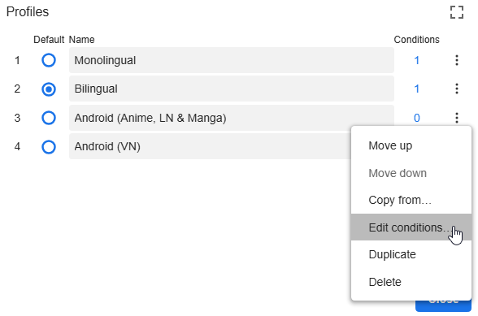
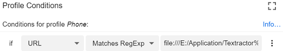

# Setup: VN on Android

- You can play `Visual Novel` using an `Android` device running `Steam Link`
- Your `PC` must be running as the `Android` device will stream from your `PC`
- It still has all the features just as if you were in your `PC`

---

## Requirements

For PC:

- [Yomitan On PC](setupYomitanOnPC.md), [ShareX](setupShareX.md) and [VN on PC](setupVnOnPC.md) already set-up

- Running `Anki`, `Steam`, `Textractor` and `Texthooker` page

For Android:

- Install and Run [Steam Link](https://play.google.com/store/apps/details?id=com.valvesoftware.steamlink&hl=en_US)

!!! info "Note"

    `Visual Novel` doesn't have to be a steam game and `Steam Link` can run basically any games

---

## Setting Up

1. In your `PC`, open your `Steam Settings` > `Controller` > `Desktop Configuration`
    - You must have your `Steam Link` connected and opened in your android while doing this on your PC

    {height=250 width=500}

2. Customize your `M1-M8` with whatever keybinds you like for your mining or whatever like ShareX e.g. `alt + shift + C` (screenshot)

    {height=500 width=1000}

3. In your `Android`, open `Steam Link` > `Settings` > `Streaming` > `2nd page` > `Launch Mode` > `Desktop` (to disable Big Picture)

    {height=500 width=1000}

4. Use `Steam link` > `shake your android`(if icon is not there) > open the `top left icon` > `Touch Controller` ENABLED > `Layout Controls`
    - Add your macro buttons; like screenshot, audio record, ctrl etc.
    - Erase controller buttons as you won't need them

    {height=500 width=1000}

5. Use `Mouse Trackpad` not direct cursor (or you can't switch monitor)

    {height=500 width=1000}

6. On your `PC` make sure `Texthooker Page` and `Visual Novel` is on different screen, then run your `Steam Link`
    - Make sure when you run your `Visual Novel`, it is not launched via `Steam` or controller layout would not work

7. Proceed to [Yomitan Configuration](setupVnOnAndroid.md/#yomitan-configuration) and [Mining VN on Android](setupVnOnAndroid.md/#mining-vn-on-android)

---

## Yomitan Configuration

1. On `PC`, [Textractor 5.2.0](https://drive.google.com/drive/folders/1up23CRT4JDMYeHlhhTISrBQHlLB1xezZ?usp=sharing) and extract([?](https://www.webhostinghub.com/help/learn/website/managing-files/extract-file)) (Pass: `lazyguide`) folder, open `texthooker - android` page

2. In your `texthooker - android` page, copy the `URL`

    {height=250 width=500}

3. On `PC`, open `Yomitan Settings` > `Profile` > `Configure Profiles...` > `Android (VN)` > `Options` > `Edit conditions...`

    {height=250 width=500}

4. Set it to `If URL` and `Matches RegExp` and paste the `URL` on the `3rd box` from `step 2`

    {height=250 width=500}

---

## Mining VN on Android

1. `Drag your mouse` out of your screen to where your other monitor is(left or right)

2. `TAP` your screen to switch monitor

3. `Add Yomitan` words like usual

4. `Use the macros` that [you've set](setupVnOnAndroid.md/#setting-up) for screenshot/audio (`ShareX`)

!!! info "Note"

    - If you only have 1 monitor, customize your `Steam Controller Settings` > [M1-M8](setupVnOnAndroid.md/#setting-up) and put an `alt-tab` macro
    - You can also turn off your PC Monitor when using this setup

Macros on my Steam Link:

{height=500 width=1000}

Yomitan/Texthooker Page on my Android:

{height=500 width=1000}

You now mine VN on Android, why not check out Mining Light Novel on PC?

[Proceed to LN on PC Setup](setupLnOnPC.md){ .md-button .md-button }

<small>If you have any problems check [FAQs](setupVnOnAndroid.md/#faqs)</small>

---

## Extra Info and Tips

#### Tip 1: Zoom in your `texthooker - android` page

??? tip "Zoom in your texthooker - android page <small>(click here)</small>"

    - If it's not big enough for you, on your `PC` > `texthooker - android` page, Zoom in with `Ctrl + Mouse Scroll Wheel` to the `%` that you like

## FAQs

#### Question 1: How to use Monolingual Setup?

??? question "How to use Monolingual Setup? <small>(click here)</small>"

    1. In your `PC`, go to `Yomitan` settings > `Profile (Editing)` > `Android (VN)`
    
    2. `Yomitan` settings > `Dictionary` > Enable `all`

        {height=250 width=500}
