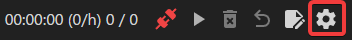
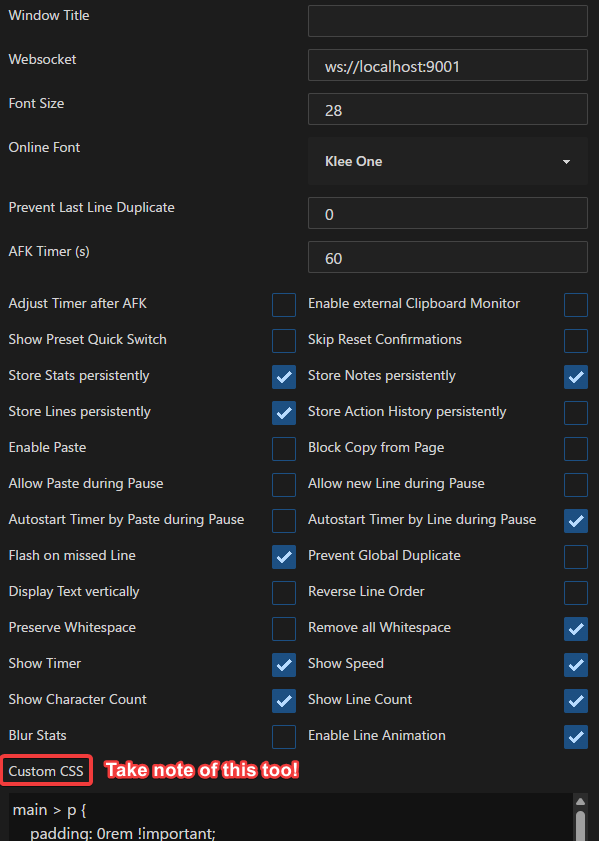

# Setup: VN on PC

- [Textractor](setupVnOnPC.md/#setup-textractor) is a tool used to extract `text` from `Visual Novels`

---

Requirements:

- [Yomitan On PC](setupYomitanOnPC.md) already set-up
- Download [Textractor 5.2.0](https://drive.google.com/drive/folders/1up23CRT4JDMYeHlhhTISrBQHlLB1xezZ?usp=sharing) and extract([?](https://www.webhostinghub.com/help/learn/website/managing-files/extract-file)) (Pass: `lazyguide`)
    - Some versions are messed up so I recommend sticking to this
    - (Optional) If you don't want to `Alt + Tab` or don't have a 2nd monitor to display `Texthooker Page`:
        - [VN Texthooker on Android](https://rentry.co/android-texthook) and [Android Setup](setupLnOnAndroid.md)

 Set the System Locale - JP

- This is required for `Visual Novel` to `run`

??? note "Set: System Locale - JP <small>(click here)</small>"

    1. In your `PC`, press `Win + R` key

    2. Type `intl.cpl` > `enter`

    3. `Administrative` > `Change System Locale...` > `Japanese (Japan)` > Restart your `PC`
        - This doesn't affect your `language` on `PC`

        {height=250 width=500}

---

## Setup: Textractor

1. Open the `Textractor` folder > `x86` > `Textractor`
    - 99% of the time `x86` is better
    - You can also create a `shortcut` or pin it to your taskbar

    {height=250 width=500}

2. Open `Textractor` app and check `Extensions`, if something is missing from my list, you can drag it from the folder into the extension window

    {height=500 width=1000}

3. Open your `Visual Novel` then on your `Textractor` > `Attach to game` > `Find your Visual Novel`
    - Sometimes it is named engine, not actual VN name e.g. SiglusEngine
    - It should look like this after attaching

        {height=500 width=1000}

4. On your `Visual Novel`, play it so it can generate the text from the game, after 1-2 dialogues, check back on your `Texthooker` and find a `suitable hooked text` from the drop-down menu
    - Check [Extra Info and Tips](setupVnOnPC.md/#extra-info-and-tips) if you have trouble finding the proper hook or the text is messy

5. If it's working properly it should look like this:
    - Click `Save hook(s)` if everything is alright

=== "Textractor and Regex Filter"
    {height=300 width=600}
=== "Visual Novel Sample"
    {height=500 width=1000}

It is now texthooking, proceed to the guide below to be able to use the text from `Textractor` and use `Yomitan` on it

---

## Setup: Texthooker Page

Requirements:

Make sure [Textractor](setupVnOnPC.md#setup-textractor) is already setup and running

Your `Visual Novel` running and already pasting text to `Textractor` like [this](setupVnOnPC.md#__tabbed_1_1)

---

1. Go to `Textractor 5.2.0` folder and open `texthooker` page

    {height=150 width=300}

2. On the `texthooker` page, go to settings(on the top right):

    {height=150 width=300}

3. Copy the settings and paste the [Custom CSS](setupVnOnPC.md#__tabbed_2_2) after:

    === "Settings"
        {height=200 width=400}
    === "Custom CSS"
        ```
        main > p {
            padding: 0rem !important;
        }

        main {
            padding-left: min(3%, 5rem) !important;
            padding-right: min(3%, 5rem) !important;
        }

        body > div > textarea {
            font-size: 24px !important;
        }
        ```

4. On the `texthooker` page, click the `plug` icon to turn on:
    - It should turn `green`

    {height=150 width=300}

5. Go back to your `Visual Novel` and try progressing on dialogues and it should be already working:

    {height=300 width=600}

6. Done! You should now be able to hover over words and mine

Now that the `Texthooker Page` is working, let's proceed on learning how to play Visual Novel on Android

[Proceed to VN on Android Setup](setupVnOnAndroid.md){ .md-button .md-button }

<small>If you have any problems check [FAQs](setupVnOnPC.md/#faqs)</small>

---

## Extra Info and Tips

#### Info 1: Finding the proper texthook

??? info "Finding the proper texthook <small>(click here)</small>"

    - Some VNs is hard to hook, messed and/or missing text, on which case **you need to manually find a hook**([video guide](https://www.youtube.com/watch?v=eecEOacF6mw)) or **search the internet for one** (e.g. Riddle Joker hookcode) then `add hook` > `save hook`

    - Some **VNs problem is the version itself**, you'll be safe using `JP` only version rather than steam/multi-language versions

#### Info 2: Using Regex to remove unnecessary text

??? info "Using Regex to remove unnecessary text <small>(click here)</small>"

    - When all text is present **but there is unnecessary unwanted text**, you need to use [regex filter](https://github.com/Artikash/Textractor/wiki/FAQ#textractor-is-extracting-text-mostly-correctly-but-theres-some-extra-characters-as-markupgarbage-eg-a-n-in-place-of-every-line-break-is-there-a-way-to-clean-the-text) which is usually on the 2nd tab of Textractor

    - For regex you need some techy knowledge or search around for a specific VN

#### Info 3: Setting the dialogue speed to max to prevent missing text

??? info "Setting the dialogue speed to max to prevent missing text <small>(click here)</small>"

    - Some Visual Novels are sensitive, and that it will only textract a portion of its text since the dialogue appeared slowly
        - Max up the dialogue speed in the VN settings

## FAQs