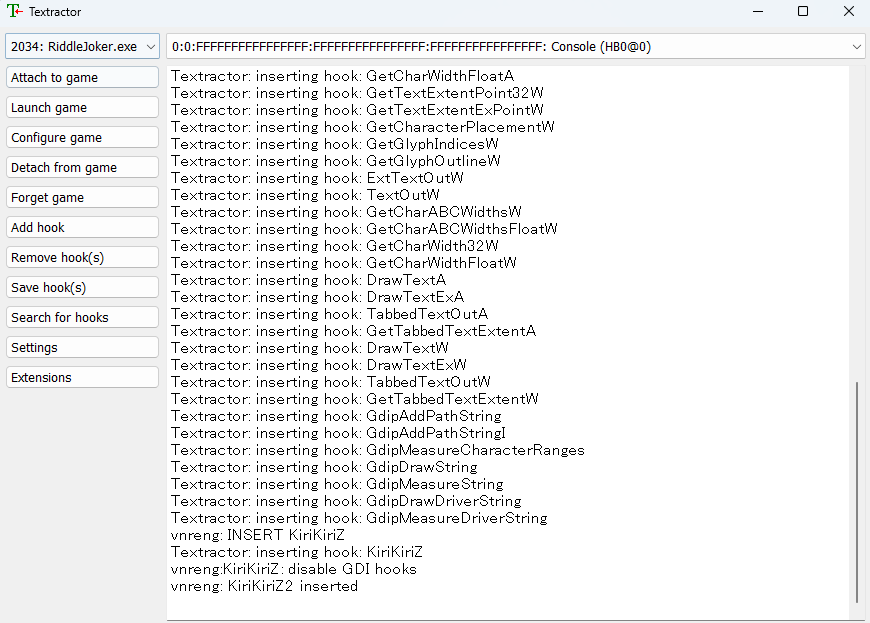
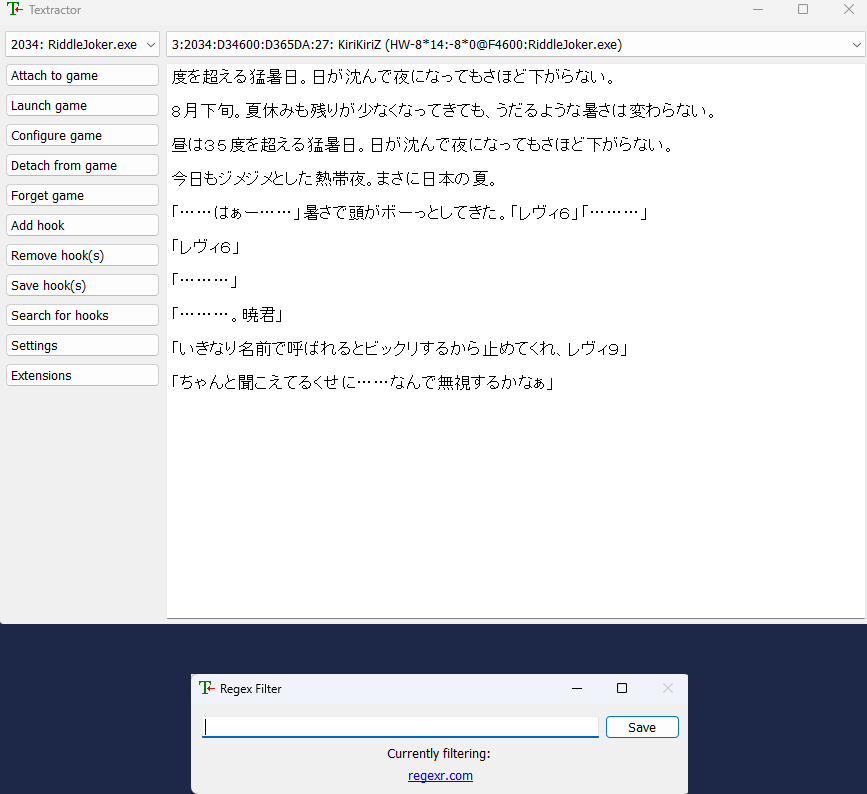

# Setup: VN on PC

- [Textractor](https://xelieu.github.io/jp-lazy-guide/setupVnOnPC/#textractor) is a tool used to extract `text` from `Visual Novels`

- [Clipboard Inserter](https://xelieu.github.io/jp-lazy-guide/setupVnOnPC/#clipboard-inserter) is used to copy and paste the text extracted by `Textractor` into a `Texthooker` page where you can use `Yomichan` to scan the words and mine it into `Anki`

---
## Textractor

Download [Textractor 5.2.0](https://drive.google.com/drive/folders/1HPhYtqcNK66EvAjQnW3Y7jSUYEkwRAEw?usp=sharing) folder

- Some versions are messed up so I recommend sticking to this

- (Optional) [VN Texthooker on Phone](https://rentry.co/android-texthook); [Mobile Setup](https://xelieu.github.io/jp-lazy-guide/setupLnOnAndroid/) is required
    - If you don't have 2nd monitor or want to full screen

---

## Setup: Textractor

1. Open the `Textractor` folder > `x86` > `Textractor`
    - 99% of the time `x86` is better
    - You can also create a `shortcut` or pin it to your taskbar

    {height=250 width=500}

2. Open `Textractor` app and check `Extensions`, if something is missing from my list, you can drag it from the folder into the extension window

    {height=500 width=1000}

3. Open your `Visual Novel` then on your `Textractor` > `Attach to game` > `Find your Visual Novel`
    - Sometimes it is named engine, not actual VN name e.g. SiglusEngine
    - It should look like this after attaching

        {height=500 width=1000}

4. On your `Visual Novel`, play it so it can generate the text from the game, after 1-2 dialogues, check back on your `Texthooker` and find a `suitable hooked text` from the drop-down menu
    - Check [Extra Info and Tips](https://xelieu.github.io/jp-lazy-guide/setupVnOnPC/#extra-info-and-tips) if you have trouble finding the proper hook or the text is messy

5. If its working properly it should look like this:

=== "Textractor and Regex Filter"
    {height=300 width=600}
=== "Visual Novel Sample"
    {height=500 width=1000}

It is now texthooking, proceed to [Clipboard Inserter](https://xelieu.github.io/jp-lazy-guide/setupVnOnPC/#clipboard-inserter) to be able to use the text from `Textractor` and use `Yomichan` on it

---

## Clipboard Inserter

- Download `Clipboard Inserter` from [Chrome/Edge](https://chrome.google.com/webstore/detail/clipboard-inserter/deahejllghicakhplliloeheabddjajm) or [Firefox](https://addons.mozilla.org/en-US/firefox/addon/lap-clipboard-inserter/)

- `Clipboard Inserter` with `texthooker` page from the [Textractor 5.2.0](https://drive.google.com/drive/folders/1HPhYtqcNK66EvAjQnW3Y7jSUYEkwRAEw?usp=sharing) folder 
    - Alternative [Texthooker Page w/ Websocket](https://github.com/Renji-XD/texthooker-ui) (only for know-how)

---

## Setup: Clipboard Inserter

1. Go to `chrome://extensions` or `edge://extensions` (not needed for firefox) and go to `Clipboard Inserter` extension settings

2. Make sure `Allow access to file URLs` is enabled

    {height=150 width=300}

3. Go to `Textractor 5.2.0` folder and open `texthooker` page

    {height=150 width=300}

4. Turn on `Clipboard Inserter` Extension by clicking on it at the `Texthooker Page` located at the top right

    {height=50 width=100}

5. If working as intended it should paste anything you copy or from textractor:
    - You can now use yomichan on it

    {height=300 width=600}

Now that the Clipboard Inserter is working, let's proceed on knowing how to play Visual Novel on Android

[Proceed to VN on Android Setup](setupVnOnAndroid.md){ .md-button .md-button }

---

## Extra Info and Tips

#### Info 1: Finding the proper `texthook`

??? info "Finding the proper texthook <small>(click here)</small>"

    - Some VNs is hard to hook, messed and/or missing text, on which case **you need to manually find a hook**([video guide](https://www.youtube.com/watch?v=eecEOacF6mw)) or **search the internet for one** (e.g. Riddle Joker hookcode) then `add hook` > `save hook`

    - Some **VNs problem is the version itself**, you'll be safe using `JP` only version rather than steam/multi-language versions

#### Info 2: Using Regex to remove unnecessary text

??? info "Using Regex to remove unnecessary text <small>(click here)</small>"

    - When all text is present **but there is unnecessary unwanted text**, you need to use [regex filter](https://github.com/Artikash/Textractor/wiki/FAQ#textractor-is-extracting-text-mostly-correctly-but-theres-some-extra-characters-as-markupgarbage-eg-a-n-in-place-of-every-line-break-is-there-a-way-to-clean-the-text) which is usually on the 2nd tab of Textractor

    - For regex you need some techy knowledge or search around for a specific VN

#### Tip 1: Getting Visual Novels

??? tip "Getting Visual Novels <small>(click here)</small>"

    To get VNs, search around the web, go to `nyaa` or discord servers that have them or `BUY` them

    - If you pm me, I can give you more details