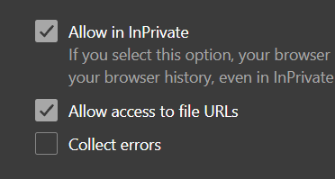
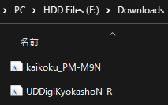
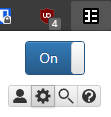
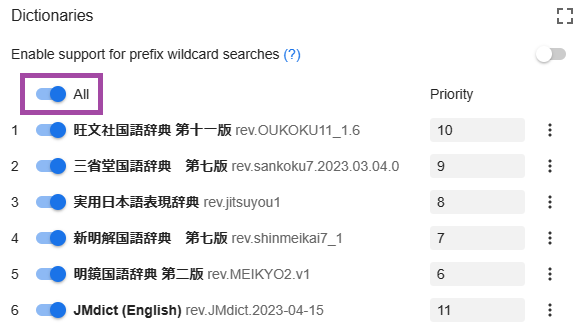

# Setup Yomichan

- Yomichan is a mouse hover dictionary for Japanese
- Used for `mining` to `Anki`
- Yomichan [Light](../img/yomichan-light.png) | [Dark](../img/yomichan-dark.png) Mode

---

## Download and Install
Pick a browser

Firefox

- Download [Yomibaba Firefox](https://github.com/forsakeninfinity/yomibaba/releases/download/22.11.3.3/yomibaba-firefox-signed-22.11.3.3.xpi) and drag it onto your Firefox window, or just double click it

Chrome

- Download [Yomibaba Chrome](https://github.com/forsakeninfinity/yomibaba/releases/download/22.11.3.3/yomibaba-chrome.zip) and unzip it somewhere
- Go to `chrome://extensions/` and turn on `developer mode` from the top right
- Click `Load unpacked` and select the unzipped folder

Download `LazyXel Yomichan Setup` and `Font` from [here](https://drive.google.com/drive/folders/1s_PdQ9HWvpDFXkh_AGGzVgqrFBGhUsbI?usp=sharing) and extract it

---

## Setting Up

1. Go to `chrome://extensions` or `edge://extensions` (not needed for firefox) and go to `Yomichan` extension settings

2. Make sure `Allow access to file URLs` is enabled

    {height=150 width=300}

3. Install the `Fonts` by opening them from the `Font` folder

    {height=150 width=300}

4. Go to Yomibaba’s settings page (Click on the extension’s icon then click on the cog icon from the popup)

    {height=50 width=100}

5. Scroll Down to `Backup` and click `Import Dictionary Data` and select `lazyXel-yomichan-dictionaries` file (from the extracted folder)

    {height=250 width=500}

6. Wait for the import to finish then turn all the dictionaries on from the `Dictionaries` > `Configure installed and enbaled dictionaries...`
    - Refresh the browser tab to see the dictionaries in effect,
restart the browser if you keep running into issues

    {height=250 width=500}

7. Scroll down again, in `Backup` > `Import Settings` > `lazyxel-yomichan-settings` (from the extracted folder)
    - If you are interested on installing [Yomichan Local Audio](https://xelieu.github.io/jp-lazy-guide/jp-lazy-guide/setupYomichan/#yomichan-local-audio) pick `lazyXel-local-audio`, otherwise `lazyXel-non-local-audio`

8. Pick a profile(`Default` and `Editing`), usually between `Monolingual` and `Bilingual` (other profiles will be discussed in other sections)
    - `Bilingual` is default, you can hold `alt` while hovering over a word to use the `Monolingual` profile

    {align=left height=300 width=600}

Yomichan setup is done, next is ShareX for convenient Mining

[Proceed to ShareX Setup](setupShareX.md){ .md-button .md-button }

---

## Extra Info and Tips

#### Info 1: Yomichan Dictionary List

??? info "Yomichan Dictionary List <small>(click here)</small>"

    - (Monolingual) 旺文社国語辞典 第十一版
    - (Monolingual) 三省堂国語辞典　第七版
    - (Monolingual) 実用日本語表現辞典
    - (Monolingual) 新明解国語辞典　第七版
    - (Monolingual) 明鏡国語辞典 第二版
    - (Bilingual) JMdict (English)
    - (Variant Forms) JMdict Forms
    - (Name) JMnedict
    - (Pitch Accent) アクセント辞典
    - (Frequency) BCCWJ
    - (Frequency) JPDB
    - (Frequency) ICR
    - (Frequency) Narou
    - (Frequency) VN
    - (Frequency) CC100
    - (Kanji Forms) JPDB Kanji
    - (Kanji Forms) Kanjidic (English)
    - (Kanji Forms) TheKanjiMap Kanji Radicals/Composition

#### Info 2: Yomichan Local Audio

??? info "Yomichan Local Audio <small>(click here)</small>"

    - Here's the [source](https://github.com/Aquafina-water-bottle/local-audio-yomichan) for more info or latest updates
    - This might take an hour due to extraction; need Anki 2.1.50+
    - [Yomichan Local Audio Source for Android]() is also available but this(PC) setup is required

    ---

    1. Download everything from [torrent](https://nyaa.si/view/1681655) or [magnet link](magnet:?xt=urn:btih:ef90ec428e6abcd560ffc85a2a1c083e0399d003&dn=local-yomichan-audio-collection-2023-06-11-opus.tar.xz&tr=http%3a%2f%2fanidex.moe%3a6969%2fannounce&tr=http%3a%2f%2fnyaa.tracker.wf%3a7777%2fannounce&tr=udp%3a%2f%2fexodus.desync.com%3a6969%2fannounce&tr=udp%3a%2f%2ftracker.opentrackr.org%3a1337%2fannounce&tr=udp%3a%2f%2fopen.stealth.si%3a80%2fannounce&tr=udp%3a%2f%2ftracker.tiny-vps.com%3a6969%2fannounce&tr=udp%3a%2f%2ftracker.moeking.me%3a6969%2fannounce&tr=udp%3a%2f%2fopentracker.i2p.rocks%3a6969%2fannounce&tr=udp%3a%2f%2ftracker.openbittorrent.com%3a6969%2fannounce&tr=udp%3a%2f%2ftracker.torrent.eu.org%3a451%2fannounce&tr=udp%3a%2f%2fexplodie.org%3a6969%2fannounce&tr=udp%3a%2f%2ftracker.zerobytes.xyz%3a1337%2fannounce): `local-yomichan-audio-collection-2023-06-11-opus.tar.xz` file
        - If you are using `AnkiMobile` on `iOS`, `Android 4`(very unlikely) or `AnkiWeb`: [torrent](https://nyaa.si/view/1681654) or [magnet link](magnet:?xt=urn:btih:5bd0aa89667860e68b31a585dc6e7a2bfc811702&dn=local-yomichan-audio-collection-2023-06-11-mp3.tar.xz&tr=http%3a%2f%2fanidex.moe%3a6969%2fannounce&tr=http%3a%2f%2fnyaa.tracker.wf%3a7777%2fannounce&tr=udp%3a%2f%2fexodus.desync.com%3a6969%2fannounce&tr=udp%3a%2f%2ftracker.opentrackr.org%3a1337%2fannounce&tr=udp%3a%2f%2fopen.stealth.si%3a80%2fannounce&tr=udp%3a%2f%2ftracker.tiny-vps.com%3a6969%2fannounce&tr=udp%3a%2f%2ftracker.moeking.me%3a6969%2fannounce&tr=udp%3a%2f%2fopentracker.i2p.rocks%3a6969%2fannounce&tr=udp%3a%2f%2ftracker.openbittorrent.com%3a6969%2fannounce&tr=udp%3a%2f%2ftracker.torrent.eu.org%3a451%2fannounce&tr=udp%3a%2f%2fexplodie.org%3a6969%2fannounce&tr=udp%3a%2f%2ftracker.zerobytes.xyz%3a1337%2fannounce) `local-yomichan-audio-collection-2023-06-11-mp3.tar.xz` file

    2. Within `Anki`: either `Ctrl + Shift + A` or `Tools` > `Add-ons` > `Get Add-ons...` > `1045800357` > restart `Anki`

    3. Extract `local-yomichan-audio-collection` and paste the `user_files` folder to:
    
    - On `Add-ons window` > select the `Local Audio Server for Yomichan` > `View Files`
    - Or `C:\Users\YourUser\AppData\Roaming\Anki2\addons21\1045800357`

    4. My `local-audio-yomichan` settings OR if you are not using my profile:
    - Go to `yomichan settings` > `Audio` > `Configure audio playback sources...` > `Add` > `Custom URL (JSON)`
    - Paste `http://localhost:5050/?term={term}&reading={reading}` and make sure it's on the top

#### Info 3: Yomichan Light and Dark Mode

??? info "Yomichan Light and Dark Mode <small>(click here)</small>"

    To change the yomichan theme, go to `yomichan settings` > `Appearance` > `Theme`

    {height=300 width=600}

