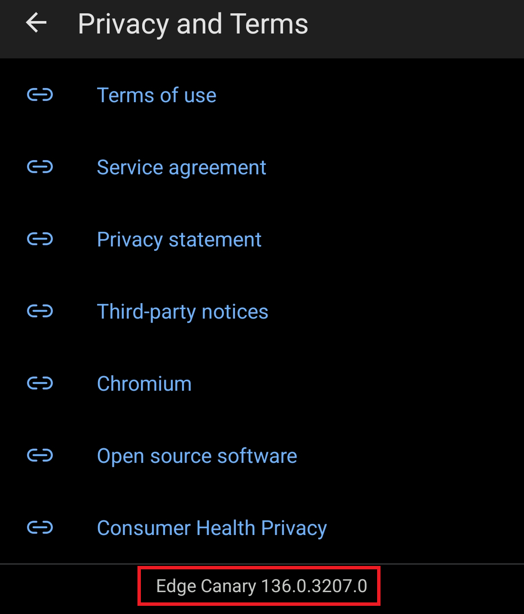
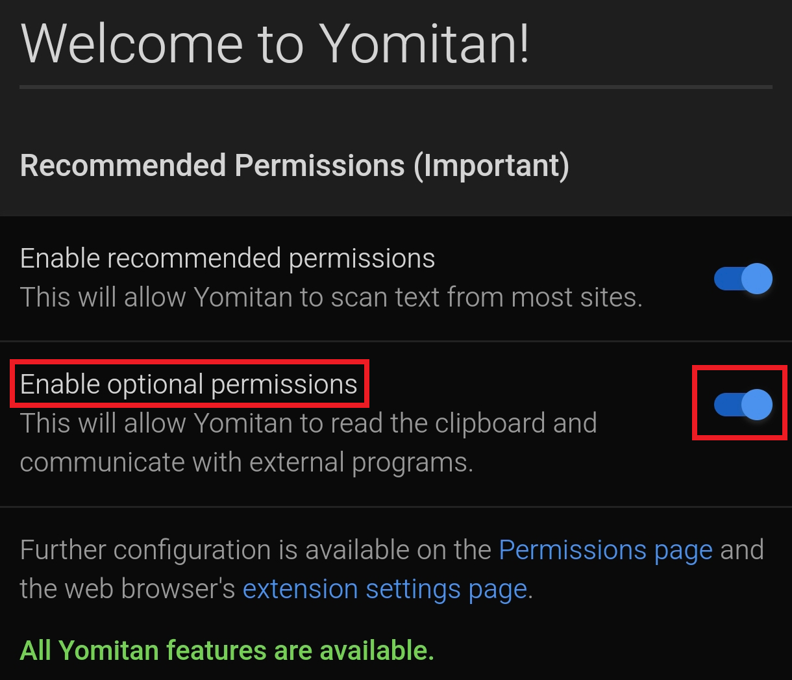
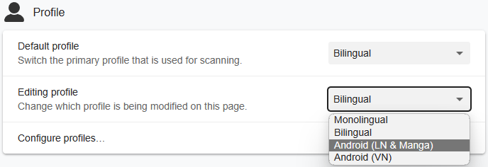
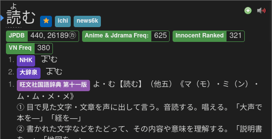
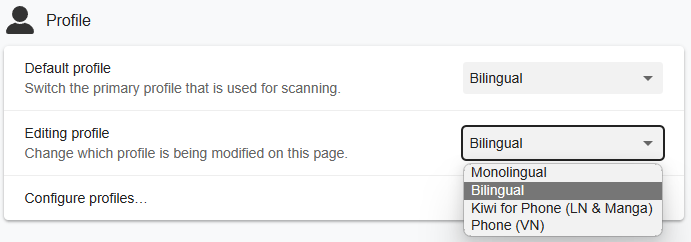
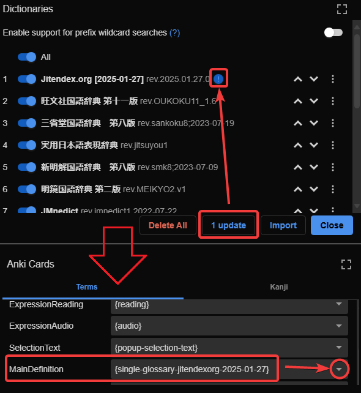

# Setup Yomitan Android

- Yomitan is a word hover dictionary for Japanese
- Used for `mining` to `Anki`
- Yomitan [Light](../img/yomitan-light.png) | [Dark](../img/yomitan-dark.png) Mode ([CSS](https://pastebin.com/F2tEkJpi))

---

## Download and Install

- Install [Edge Canary](https://play.google.com/store/apps/details?id=com.microsoft.emmx.canary)
    - I don't recommend `Firefox` on Android because you can't enable `Experimental Web Features` for [Anime on Android](setupAnimeOnAndroid.md)

- Download from [here](https://drive.google.com/drive/folders/1s_PdQ9HWvpDFXkh_AGGzVgqrFBGhUsbI?usp=sharing):
    - `Font`
    - `yomitan dictionary`
    - `lazyXel-yomitan-settings`(download both)

- After Downloading:
    - Extract([?](https://www.webhostinghub.com/help/learn/website/managing-files/extract-file)) `Font.7z` and `yomitan dictionary.7z`
    - `yomitan dictionary.7z` should only be extracted once, `don't extract the dictionary` itself

---

## Setting Up

1. Go to `Menu` > `Settings` > `About Microsoft Edge` > `Privacy and Terms` > tap `Edge Canary build number` 7 times
    - `Developer Options` should be enabled

    {height=200 width=400}

2. Go back in `Settings` > `Developer Options` > `Extension install by id` > paste this:
    ```
    idelnfbbmikgfiejhgmddlbkfgiifnnn
    ```

3. Click `Add` Yomitan Extension then wait a moment until it finishes downloading
    - The `Welcome Page` should appear automatically or go to `Settings` > `Extensions` > Tap `Yomitan Popup Dictionary` > `Settings(Cog Icon)`

4. On the `Welcome Page` extension://idelnfbbmikgfiejhgmddlbkfgiifnnn/welcome.html turn on `Enable optional permissions`

    {height=200 width=400}

5. Next, go to `Settings Page` or `Settings` > `Extensions` > Tap `Yomitan Popup Dictionary` > `Settings(Cog Icon)`

6. Go to `Dictionary` > `Configure installed and enabled dictionaries...` > `Import`
    - Import all the dictionaries from `yomitan dictionary` folder (You can select them all and import all at once)

    {height=250 width=500}

7. Then Scroll down, in `Backup` > `Import Settings` > `lazyxel-yomitan-settings` (the file from [here](setupYomitanOnAndroid.md/#download-and-install))
    - Pick either:
        - `lazyXel-local-audio-yomitan-settings` (Install: [Yomitan Local Audio](setupYomitanOnAndroid.md/#info-2-android-yomitan-local-audio))
        - `lazyXel-non-local-audio-yomitan-settings`

        {align=left height=300 width=600}

8. Pick `Android (Anime, LN & Manga)` profile (`Default` and `Editing`)

    {align=left height=300 width=600}

Yomitan setup is done, next is ShareX for convenient Mining

[Proceed to ShareX Setup](setupShareX.md){ .md-button .md-button }

<small>If you have any problems check [FAQs](setupYomitanOnAndroid.md/#faqs) or contact me on Discord: [xelieu](https://www.discordapp.com/users/719459399168426054)</small>

---

## Extra Info and Tips

#### Info 1: Yomitan Dictionary List

??? info "Yomitan Dictionary List <small>(click here)</small>"

    - (Bilingual) Jitendex
    - (Monolingual) 旺文社国語辞典 第十一版
    - (Monolingual) 三省堂国語辞典　第八版
    - (Monolingual) 実用日本語表現辞典
    - (Monolingual) 新明解国語辞典 第八版
    - (Monolingual) 明鏡国語辞典 第二版
    - (Name) JMnedict (No-Kana)
    - (Pitch Accent) アクセント辞典
    - (Frequency) JPDBv2
    - (Frequency) BCCWJ
    - (Frequency) ICR
    - (Frequency) Narou
    - (Frequency) VN
    - (Frequency) CC100
    - (Kanji Forms) JPDB Kanji
    - (Kanji Forms) Kanjidic (English)
    - (Kanji Forms) TheKanjiMap Kanji Radicals/Composition

#### Info 2: Android Yomitan Local Audio

??? info "Android Yomitan Local Audio <small>(click here)</small>"

    Requirements:
    
    - Make sure you have [PC Yomitan Local Audio](setupYomitanOnPC.md/#info-2-yomitan-local-audio) setup

    - You have [Ankiconnect Android](https://github.com/KamWithK/AnkiconnectAndroid/releases/latest) installed

    - Here's the [source](https://github.com/Aquafina-water-bottle/AnkiconnectAndroid/tree/local_audio#additional-instructions-local-audio) for more info or updates

    - This setup takes **3gb+** of space

    ---

    1. Within `Anki` on `PC`: `Tools` > `Local Audio Server` > `Generate Android database`
        - This would take 30mins+ (Anki will be unuseable but you can mine)
    
    2. Within `Anki` on `PC`: either `Ctrl + Shift + A` or `Tools` > `Add-ons` > select `Local Audio Server for Yomitan` > `View Files`
        - There will be a file named `android` or `android.db`

    3. On your android, open `AnkiConnect Android` > `Settings` > `Print Local Audio Directory`
        - This will show you the path as well as generate the folder
    
    4. On that location from 3rd step, usually: `Android/data/com.kamwithk.ankiconnectandroid/files/`
        - Paste the `android` file ON `files` folder from `PC` (2nd step)
        - The result should be: `Android/data/com.kamwithk.ankiconnectandroid/files/android.db`
    
    5. My `local-audio-yomitan-settings` profile: `Android (Anime, LN & Manga)`
        - OR if you are not using my profile:
            - Go to `Yomitan settings` > `Audio` > `Configure audio playback sources...` > `Add` > `Custom URL (JSON)`
            - Paste `http://localhost:8765/localaudio/get/?sources=jpod,jpod_alternate,nhk16,forvo&term={term}&reading={reading}` and make sure it's on the top
    
    6. To ensure it's working, check that all sources are present
        - If it doesn't work, make sure AnkiConnect Android `Start Service` is running
        - Battery saving/optimization is off for AnkiConnect Android, Ankidroid and Edge Canary

        {height=250 width=500}

        DONE!

#### Info 3: Yomitan Light and Dark Mode

??? info "Yomitan Light and Dark Mode <small>(click here)</small>"

    To change the Yomitan theme, go to `Yomitan settings` > `Appearance` > `Theme`

    {height=300 width=600}

---

## FAQs

#### Question 1: Can I add a Yomitan dictionary of my choice?

??? question "Can I add, delete or modify a Yomitan dictionary of my choice? <small>(click here)</small>"

    - Yes, most dictionaries should be compatible with the Anki format

#### Question 2: When will you update the dictionaries/should I do it myself?

??? question "When will you update the dictionaries/should I do it myself? <small>(click here)</small>"

    - I will seldomly update; no need to stress over the latest one; it barely changes its content as a dictionary
        - My goal is longterm stability without worrying about updates
        - You can update it youself if you want to chase the latest fad

#### Question 3: How can I use sentence card?

??? question "How can I use sentence card? <small>(click here)</small>"

    In your `Yomitan settings` > `Anki` > `configure Anki card format...`

    {height=300 width=600}
    
    In `Terms` scroll down and find `IsSentenceCard` and put `1` then close the window

    {height=300 width=600}

    Now apply it on every profile under `Editing Profile` and make sure `Monolingual`, `Bilingual`, `Android (Anime, LN & Manga)` and `Android (VN)` got their config changed

    {align=left height=300 width=600}

#### Question 4: How to update Jitendex?

??? question "How to update Jitendex? <small>(click here)</small>"

    Personally I don't recommend updating `Jitendex` as you'd need to mess with the settings with how it works (it has a date on its name)
    
    1. In `Yomitan` settings > `Dictionaries` > `Check Updates` > Update `Jitendex`
    2. Still in `Yomitan` > `Anki` > `Configure Anki card format...` > in `MainDefinition` > dropdown > find `single-glossary-jitendexorg-YYYY-MM-DD`
    3. Do this on every `Yomitan Profile`

    {height=250 width=500}