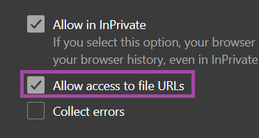

# Setup Yomitan Android

- Temporarily archiving `Import Dictionary Collection` method because there is a startup and lookup load time lag bug currently
    - It doesn't matter if you manually imported all dictionary or use imported everything all at once, the only difference is the latter have bug right now

---

??? note "Show Archive <small>(click here)</small>"

    ## Download and Install

    - Install [Kiwi Browser](https://play.google.com/store/apps/details?id=com.kiwibrowser.browser&hl=en_US)
        - (Optional) In `Kiwi Browser` Download [Violentmonkey](https://chrome.google.com/webstore/detail/violentmonkey/jinjaccalgkegednnccohejagnlnfdag) and Install [Reading Speed Indicator](https://greasyfork.org/en/scripts/459921-reading-speed-statistics-ttsu-app)
        - (Optional) In `Kiwi Browser` Download [Fullscreen](https://chrome.google.com/webstore/detail/fullscreen/lbpgkagpackldbkfookmmdpfaolnoged) Extension

    - Download [Yomitan Chrome](https://chrome.google.com/webstore/detail/yomitan-development-build/glnaenfapkkecknnmginabpmgkenenml) `(.crx)`
    - In your `Kiwi Browser`, go to `chrome://extensions/` and turn on `developer mode` from the top right
    - Click `(from .zip/.crx/.user.js)`

    Download `LazyXel Yomitan Setup`(`settings` included here) and `Font` from [here](https://drive.google.com/drive/folders/1s_PdQ9HWvpDFXkh_AGGzVgqrFBGhUsbI?usp=sharing) and extract it

    ---

    ## Setting Up

    1. On `Yomitan`'s welcome page > `Permissions page` > enable `clipboardRead` and `nativeMessaging`

        {height=250 width=500}

    2. Go to `chrome://extensions` and go to `Yomitan` extension settings

    3. Make sure `Allow access to file URLs` is enabled

        {height=150 width=300}

    4. Install the `Fonts` by opening them from the `Font` folder

        {height=150 width=300}

    5. Go to `Yomitan`’s settings page (Click on the extension’s icon then click on the cog icon from the popup)

        {height=50 width=100}

    6. Scroll Down to `Backup` and click `Import Dictionary Data` and select `lazyXel-yomitan-dictionaries` file (from the extracted folder)

        {height=250 width=500}

    7. Wait for the import to finish then turn all the dictionaries on from the `Dictionaries` > `Configure installed and enabled dictionaries...`
        - Refresh the browser tab to see the dictionaries in effect,
    restart the browser if you keep running into issues

        {height=250 width=500}

    8. Scroll down again, in `Backup` > `Import Settings` > `lazyxel-yomitan-settings` (from the extracted folder)
        - If you are interested on installing [Yomitan Local Audio](https://xelieu.github.io/jp-lazy-guide/setupYomitanOnAndroid/#info-2-android-yomitan-local-audio) pick `lazyXel-local-audio`, otherwise `lazyXel-non-local-audio`
        - `Import` NOT `Sanitize and Import`

            {height=150 width=300}

    9. Pick `Android (LN & Manga)` profile (`Default` and `Editing`)

        {align=left height=300 width=600}

    Yomitan setup is done, next is ShareX for convenient Mining

    [Proceed to ShareX Setup](setupShareX.md){ .md-button .md-button }

    <small>If you have any problems check [FAQs](https://xelieu.github.io/jp-lazy-guide/setupyomitanOnAndroid/#faqs) or contact me on Discord: [xelieu](https://www.discordapp.com/users/719459399168426054)</small>

    ---

    ## Extra Info and Tips

    #### Info 1: Yomitan Dictionary List

    ??? info "Yomitan Dictionary List <small>(click here)</small>"

        - (Monolingual) 旺文社国語辞典 第十一版
        - (Monolingual) 三省堂国語辞典　第七版
        - (Monolingual) 実用日本語表現辞典
        - (Monolingual) 新明解国語辞典 第八版
        - (Monolingual) 明鏡国語辞典 第二版
        - (Bilingual) JMdict (English-Original)
        - (Variant Forms) JMdict Forms
        - (Name) JMnedict (No-Kana)
        - (Pitch Accent) アクセント辞典
        - (Frequency) BCCWJ
        - (Frequency) JPDB
        - (Frequency) ICR
        - (Frequency) Narou
        - (Frequency) VN
        - (Frequency) CC100
        - (Kanji Forms) JPDB Kanji
        - (Kanji Forms) Kanjidic (English)
        - (Kanji Forms) TheKanjiMap Kanji Radicals/Composition

    #### Info 2: Android Yomitan Local Audio

    ??? info "Android Yomitan Local Audio <small>(click here)</small>"

        Requirements:
        
        - Make sure you have [PC Yomitan Local Audio](https://xelieu.github.io/jp-lazy-guide/setupyomitanOnPC/#info-2-yomitan-local-audio) setup

        - You have [Ankiconnect Android](https://github.com/KamWithK/AnkiconnectAndroid/releases/latest) installed

        - Here's the [source](https://github.com/Aquafina-water-bottle/AnkiconnectAndroid/tree/local_audio#additional-instructions-local-audio) for more info or updates

        - This setup takes **3gb+** of space

        ---

        1. Within `Anki` on `PC`: `Tools` > `Local Audio Server` > `Generate Android database`
            - This would take 30mins+ (Anki will be unuseable but you can mine)
        
        2. Within `Anki` on `PC`: either `Ctrl + Shift + A` or `Tools` > `Add-ons` > select `Local Audio Server for Yomitan` > `View Files`
            - There will be a file named `android` or `android.db`

        3. On your android, open `AnkiConnect Android` > `Settings` > `Print Local Audio Directory`
            - This will show you the path as well as generate the folder
        
        4. On that location from 3rd step, usually: `Android/data/com.kamwithk.ankiconnectandroid/files/`
            - Paste the `android` file ON `files` folder from `PC` (2nd step)
            - The result should be: `Android/data/com.kamwithk.ankiconnectandroid/files/android.db`
        
        5. My `local-audio-yomitan-settings` profile: `Android (LN & Manga)`
            - OR if you are not using my profile:
                - Go to `Yomitan settings` > `Audio` > `Configure audio playback sources...` > `Add` > `Custom URL (JSON)`
                - Paste `http://localhost:8765/localaudio/get/?term={term}&reading={reading}` and make sure it's on the top
        
        6. To ensure it's working, check that all sources are present
            - If it doesn't work, make sure AnkiConnect Android `Start Service` is running
            - Battery saving/optimization is off for AnkiConnect Android, Ankidroid and Kiwi Browser

            {height=250 width=500}

            DONE!

    #### Info 3: Yomitan Light and Dark Mode

    ??? info "Yomitan Light and Dark Mode <small>(click here)</small>"

        To change the Yomitan theme, go to `Yomitan settings` > `Appearance` > `Theme`

        {height=300 width=600}

    ---

    ## FAQs

    #### Question 1: Can I add a Yomitan dictionary of my choice?

    ??? question "Can I add, delete or modify a Yomitan dictionary of my choice? <small>(click here)</small>"

        - Yes, most dictionaries should be compatible with the JPMN format
