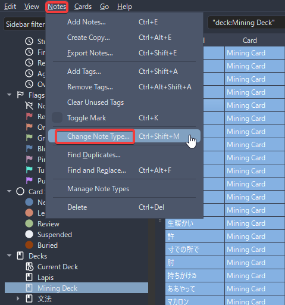
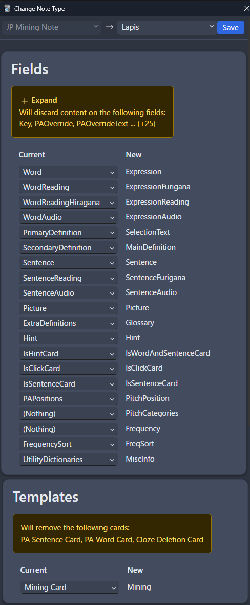

---
hide:
  - footer
---
# Transfer JPMN Setup to Lapis

- If you've been using `JPMN` Format and want to transfer to `Lapis`

!!!warning Make sure to backup your cards first
    You must `backup` your deck just to be safe

    1. On Anki, right click your `deck`
    2. Select `Export`
    3. Make sure these options are checked: `Include scheduling information`, `Include Deck presets`, `Include Media`

---

## Installing Lapis

1. Download [Lapis](https://github.com/donkuri/lapis/releases/latest) format
    - Scroll down to Assets, and look for `Lapis.apkg`
    
    {height=150 width=300}

2. Import `Lapis.apkg` to Anki

    {height=300 width=600}

3. On your Anki, go to `Browse` > click `Mining Deck` (or whatever your JPMN format name is) > click a card > `CTRL + A` or select all cards

    {height=300 width=600}

4. After that, on your menu go to `Notes` > `Change Note Type...` or `Ctrl + Shift M`

    {height=300 width=600}

5. Follow the image below and then click `Save`

    {height=300 width=400}

6. Again on your Anki, go to `Browse` > `Tags` (at the left side):
    - Right click on `nsfw` and rename it to `NSFW` (If you have it)
    - Right click on `yomitan` or `yomichan` and delete it
    - Update [ShareX settings](https://drive.google.com/drive/folders/1vxkbfe7tr27NxWP5baFaLLmqnExt-3Ba?usp=sharing) to accomodate uppercase `NSFW` tagging for Lapis
    
    {height=150 width=300}

7. Update Anki [addons](https://drive.google.com/drive/folders/1dfmYAp0eg_bhhAkohUISYaS6B6QOBtww?usp=sharing) to accommodate Lapis configs

8. Make sure to import the new [Yomitan Settings](https://drive.google.com/drive/folders/1DHJ18Lk2_tVYWJ1Adhe8XByuyFBGuTr_?usp=sharing) then restart your browser
    - (Optional) Update [Yomitan Dictionaries](https://drive.google.com/drive/folders/1DHJ18Lk2_tVYWJ1Adhe8XByuyFBGuTr_?usp=sharing)

9. Done! You can now safely delete `Lapis` deck as it was already transferred to your original `Mining Deck`

<small>If you have any problems check [FAQs](transferJPMNToLapis.md/#faqs)</small>

---

## FAQs

#### Question 1: How can I use sentence card?

??? question "How can I use sentence card? <small>(click here)</small>"

    If you haven't yet, please setup [Yomitan](setupYomitanOnPC.md) first

    ??? info "Okay, I've already set it up! <small>(click here)</small>"

        In your `Yomitan settings` > `Anki` > `configure Anki card format...`

        {height=300 width=600}
        
        In `Terms` scroll down and find `IsSentenceCard` and put `1` then close the window

        {height=300 width=600}

        Now apply it on every profile under `Editing Profile` and make sure `Monolingual`, `Bilingual`, `Android (Anime, LN & Manga)` and `Android (VN)` got their config changed

        {align=left height=300 width=600}

#### Question 2: Why update from JPMN to Lapis?

??? question "Why update from JPMN to Lapis? <small>(click here)</small>"

    - I've received lots of reports where they feel lag on JPMN(I personally don't) and Lapis is basically the lightweight version

#### Question 3: What happens to my JPMN format, now that you've updated to Lapis? Is it fine not updating?

??? question "What happens to my JPMN format, now that you've updated to Lapis? Is it fine not updating? <small>(click here)</small>"

    - My guide's goal is and will always be stability and longetivity, hence you can continue using the JPMN with no problems even on the future

    - Make sure you have [JPMN Manager](https://ankiweb.net/shared/info/301910299) installed to be notified on new updates