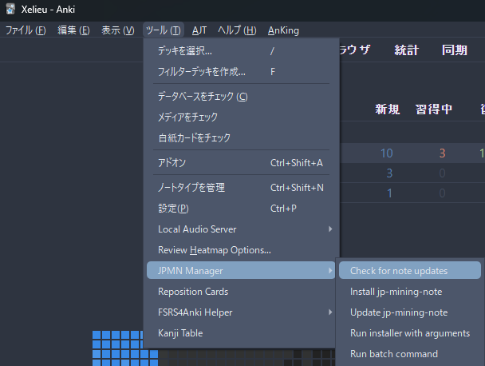

# Updating: Anki JPMN Note

- This is how to update `JPMN Note` to fix bugs or just get an actual update

### Update Watcher

- If you didn't update on or before the following dates, please update:
    - `JPMN Note`: 2024-02-18 - jp-mining-note: v0.12.0.0-prerelease-16
        - Delete old JPMN Manager, install the [new one](https://ankiweb.net/shared/info/301910299)
    - `AJT Japanese`: 2024-01-19

---

## Download and Install

1. In your Anki: `Ctrl + Shift + A` OR `Tools` > `Add-ons` > `Check for add-ons update`
    - Make sure [JPMN Manager](https://ankiweb.net/shared/info/301910299) and [AJT Japanese](https://ankiweb.net/shared/info/1344485230) is updated
    - If there's an `update`, restart your Anki

    {height=250 width=500}

!!! danger "Make sure you're using the proper JPMN Manager"

    - Make sure you have the new version: `JPMN Manager with prereleases New Version`
    - Remove the old version: `JPMN Manager with prereleases`

---

## Updating the JPMN Format

1. In your Anki's toolbar: `Tools` > `JPMN Manager` > `Check for note updates` (If there is) > Update jp-mining-note (Follow the instructions)

    {height=250 width=500}

2. Done

---

## Updating AJT Japanese

1. In your Anki `Ctrl + Shift + A` OR `Tools` > `Add-ons` > `Check for add-ons update` > if there's update, restart Anki

2. Again, `Ctrl + Shift + A` OR `Tools` > `Add-ons` > `AJT Japanese` > `View Files`

3. Open the `config.json`(edit with notepad) then copy and paste the config below:

    ??? examplecode "AJT Japanese Config <small>(click here)</small>"

        ```
        {
            "cache_lookups": 1024,
            "last_file_save_location": "",
            "profiles": [ 
                {
                    "name": "Add furigana for sentence",
                    "note_type": "JP Mining Note",
                    "source": "Sentence",
                    "destination": "SentenceReading",
                    "mode": "furigana",
                    "split_morphemes": true,
                    "triggered_by": "focus_lost,toolbar_button,note_added,bulk_add",
                    "overwrite_destination": false
                },
                {
                    "name": "Add furigana for word -- UNUSED BY jp-mining-note",
                    "note_type": "AJT_JAPANESE_IGNORE_PROFILE",
                    "source": "VocabKanji",
                    "destination": "VocabFurigana",
                    "mode": "furigana",
                    "split_morphemes": false,
                    "triggered_by": "focus_lost,toolbar_button,note_added,bulk_add",
                    "overwrite_destination": false
                },
                {
                    "name": "Add pitch accent for word",
                    "note_type": "JP Mining Note",
                    "source": "Word",
                    "destination": "AJTWordPitch",
                    "mode": "pitch",
                    "split_morphemes": false,
                    "output_format": "html",
                    "triggered_by": "focus_lost,toolbar_button,note_added,bulk_add",
                    "overwrite_destination": false
                },
                {
                    "name": "Add audio for word -- UNUSED BY jp-mining-note",
                    "note_type": "AJT_JAPANESE_IGNORE_PROFILE",
                    "source": "VocabKanji",
                    "destination": "VocabAudio",
                    "mode": "audio",
                    "split_morphemes": false,
                    "triggered_by": "focus_lost,toolbar_button,note_added,bulk_add",
                    "overwrite_destination": false
                }
            ],
            "pitch_accent": {
                "lookup_shortcut": "Ctrl+8",
                "output_hiragana": false,
                "kana_lookups": true,
                "skip_numbers": true,
                "reading_separator": "・", 
                "word_separator": "、",
                "blocklisted_words": "こと,へ,か,よ,ん,だ,び,の,や,ね,ば,て,と,た,が,に,な,は,も,ます,から,いる,たち,てる,う,ましょ,たい,する,です,ない",
                "maximum_results": 100, 
                "discard_mode": "discard_extra",
                "style": "none" 
            },
            "furigana": {
                "skip_numbers": true,
                "prefer_literal_pronunciation": false,
                "reading_separator": ", ",
                "blocklisted_words": "人",
                "mecab_only": "彼,猫,首,母,顔,木,頭,私,弟,空,体,行く",
                "maximum_results": 1, 
                "discard_mode": "discard_extra"
            },
            "context_menu": {
                "generate_furigana": true,
                "to_katakana": true,
                "to_hiragana": true,
                "literal_pronunciation": true,
                "look_up_word": true
            },
            "toolbar": { 
                "generate_all_button": {
                    "enabled": false,
                    "shortcut": "Alt+P",
                    "text": "入"
                },
                "regenerate_all_button": {
                    "enabled": false,
                    "shortcut": "Alt+;",
                    "text": "再"
                },
                "furigana_button": {
                    "enabled": false,
                    "shortcut": "",
                    "text": "振"
                },
                "hiragana_button": {
                    "enabled": false,
                    "shortcut": "",
                    "text": "平"
                },
                "clean_furigana_button": {
                    "enabled": false,
                    "shortcut": "",
                    "text": "削"
                },
                "audio_search_button": {
                    "enabled": false,
                    "shortcut": "",
                    "text": "検"
                },
                "add_definition_button": {
                    "enabled": false,
                    "shortcut": "",
                    "text": "意"
                }
            },
            "audio_sources": [
                {
                    "enabled": false, 
                    "name": "NHK-2016",
                    "url": "https://github.com/Ajatt-Tools/nhk_2016_pronunciations_index/releases/download/v1.2/NHK_main.zip"
                },
                {
                    "enabled": false,
                    "name": "NHK-1998",
                    "url": "https://github.com/Ajatt-Tools/nhk_1998_pronunciations_index/releases/download/v1.1/NHK_main.zip"
                },
                {
                    "enabled": false,
                    "name": "Shinmeikai-8",
                    "url": "https://github.com/Ajatt-Tools/shinmeikai_8_pronunciations_index/releases/download/v1.5/Shinmeikai-8_main.zip"
                },
                {
                    "enabled": false,
                    "name": "Daijisen",
                    "url": "https://github.com/Ajatt-Tools/daijisen_pronunciations_index/releases/download/v1.0/Daijisen_main.zip"
                },
                {
                    "enabled": false,
                    "name": "TAAS",
                    "url": "https://github.com/Ajatt-Tools/taas_pronunciations_index/releases/download/v1.0/TAAS_main.zip"
                }
            ],
            "audio_settings": {
                "dictionary_download_timeout": 30,
                "audio_download_timeout": 6,
                "attempts": 4,
                "maximum_results": 99,
                "ignore_inflections": false,
                "stop_if_one_source_has_results": false,
                "search_dialog_field_name": "VocabAudio",
                "tag_separator": "<br>"
            },
            "definitions": {
                "timeout": 10,
                "remove_marks": true,
                "dict_name": "meikyou",
                "search_type": "exact",
                "source": "VocabKanji",
                "destination": "VocabDef",
                "behavior": "append"
            }
        }
        ```

4. AGAIN, restart your Anki (I know xD), then `Tools` > `JPMN Manager` > `Run batch command` > Paste the `command` below:

    ```
    empty_field AJTWordPitch
    ```

5. In your Anki's Main Window > `Browse`
    - In the left side under `Note Types`, Click on `JP Mining Note`
    - Select all cards by clicking on 1 card and then `Ctrl + A`

6. In the toolbar on the top left, select `Edit` > `AJT: Bulk-generate`
    - Wait for the process to finish

7. Done! To check if the card has no problem, view a card > check if the `!` icon on the top left isn't red

??? danger "If you didn't update then the following features will be missing: <small>(click here)</small>"

    - Automatically generated furigana
    - Devoiced and nasal information to pitch accents
    - Less coverage on pitch accents