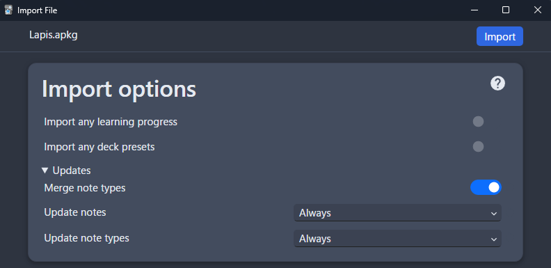

---
hide:
  - footer
---
# Updating: Lapis Format

- This is how to update `Lapis` Format to fix bugs or just get an actual update

---

### Download and Install

1. Download the latest version of [Lapis](https://github.com/donkuri/lapis/releases/latest) format
    - Scroll down to Assets, and look for `Lapis.apkg`
    
    {height=150 width=300}

2. Install `Lapis.apkg` to Anki and follow the image below then `Import`

    {height=300 width=600}

3. Done!