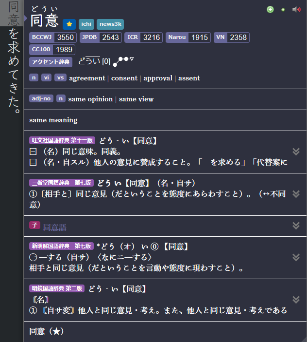

---
hide:
  - footer
---
Lazy Guide is for:

- People who don't want to bother customizing their settings or knowing stuff technically
- For people who want an all-in-one source compared to other fully detailed guides but scattered tools
- You want an import everything and done

New to Japanese and want to immerse quickly? see [Concise Guide to Jumpstart Japanese](setup.md)

If you want to buy me a coffee(Thanks!): [Ko-fi (Xelieu)](https://ko-fi.com/xelieu)

---

#### [Anki Features](https://aquafina-water-bottle.github.io/jp-mining-note/)

- 4 in 1 Profile Support: `Monolingual`, `Bilingual`, `LN & Manga in Android`, `VN in Android`

=== "Anki Format"
    { align=left height=300 width=600}
=== "Yomichan Format"
    { align=left height=300 width=600}
=== "Yomichan Profile"
    { align=left height=300 width=600}

---

#### [Mining Demo](https://youtu.be/seAMOvIiFcw)
- This is outdated format but pretty much same method

<iframe width="560" height="315" src="https://www.youtube.com/embed/seAMOvIiFcw" title="YouTube video player" frameborder="0" allow="accelerometer; autoplay; clipboard-write; encrypted-media; gyroscope; picture-in-picture; web-share" allowfullscreen></iframe>

[Alright, Let's go! :fontawesome-solid-paper-plane:](setup.md){ .md-button .md-button }